# Faz 0 Mimari & Durum Haritası — Sonuç Raporu

**Versiyon:** v0.1.7 (Faz 0 final — tag `v0.1.7`, commit `4ae0d22`)
**Tarih:** 2026-05-17
**Kapsam:** CleanTenant Faz 0 — temel altyapı tamamlandı; Faz 1 (UI) başlangıcı için sistemin diyagramatik üst-bakışı.

Bu doküman, [CHANGELOG.md](CHANGELOG.md) ile **birlikte okunur**. CHANGELOG kronolojik / detaylı, bu rapor üst-bakış / görsel / topluca. Tüm Mermaid diyagramları hem **kod bloğu** olarak (GitHub auto-render) hem de **PNG** olarak [architecture-diagrams/](architecture-diagrams/) altında.

---

## İçindekiler

- [0. Yönetici Özeti](#0-yönetici-özeti)
- [1. Sistem Bağlam Diyagramı (C4 Level 1)](#1-sistem-bağlam-diyagramı-c4-level-1)
- [2. Proje Bağımlılık Haritası (C4 Level 2)](#2-proje-bağımlılık-haritası-c4-level-2)
- [3. Clean Architecture Katmanları](#3-clean-architecture-katmanları)
- [4. Catalog DB — ER Diyagramı](#4-catalog-db--er-diyagramı)
- [5. Audit DB — ER Diyagramı](#5-audit-db--er-diyagramı)
- [6. Log DB — Şema](#6-log-db--şema)
- [7. Hibrit JWT + Redis Session Mimarisi](#7-hibrit-jwt--redis-session-mimarisi)
- [8. Login + 2FA Akışı](#8-login--2fa-akışı)
- [9. Multi-Scope + Persona Geçiş Durumları](#9-multi-scope--persona-geçiş-durumları)
- [10. Support Mode State Diyagramı](#10-support-mode-state-diyagramı)
- [11. MediatR Pipeline Akışı](#11-mediatr-pipeline-akışı)
- [12. Audit + Log Akışı](#12-audit--log-akışı)
- [13. Endpoint Kataloğu](#13-endpoint-kataloğu)
- [14. 4-DB Mimarisi](#14-4-db-mimarisi)
- [15. Test Piramidi](#15-test-piramidi)
- [16. Sürüm Geçmişi & Git Tag'leri](#16-sürüm-geçmişi--git-tagleri)
- [17. Açık Konular & Teknik Borç](#17-açık-konular--teknik-borç)
- [18. Faz 1 — Detaylı Brifing](#18-faz-1--detaylı-brifing)
- [Appendix A: Build & Test Doğrulama Çıktıları](#appendix-a-build--test-doğrulama-çıktıları)

---

## 0. Yönetici Özeti

**Faz 0'da ne yapıldı?**

| Yıllık geçit | Sonuç |
|---|---|
| v0.1.1 | Solution + 16 proje + .NET 10 SDK pin + Directory.Build.props |
| v0.1.2 | Docker compose (4 ortam) + PG 17 + Redis 8 + Seq + env scripts |
| v0.1.3 | SharedKernel (Result, BaseEntity, Base58 UrlCode, TR normalizer) |
| v0.1.4.a | Catalog şeması + EF Core + ilk migration (16 tablo) |
| v0.1.4.b | Interceptor + Factory + Seed + 21 integration test |
| v0.1.5.a | Hibrit JWT + Redis session + refresh rotation |
| v0.1.5.a.1 | Program.cs temizliği + email/TCKN/telefon login |
| v0.1.5.a.2 | VKN/YKN + ManagementApp MudBlazor |
| v0.1.5.b.1 | Multi-scope login + switch-context + force-logout (policy auth) |
| **v0.1.5.b.2** | **Support Mode (Enter/Exit/Elevate/Impersonate)** — tag #1 |
| **v0.1.5.c** | **2FA İskeleti (TOTP+Email+SMS+Recovery)** — tag #2 |
| **v0.1.6** | **MediatR pipeline + FluentValidation + Permission Checker** — tag #3 |
| **v0.1.7** | **Audit Interceptor + Serilog + detaylı bağlam** — tag #4 (Faz 0 kapanış) |

**Sayısal özet:**

- 4 git tag (`v0.1.5.b.2`, `v0.1.5.c`, `v0.1.6`, `v0.1.7`)
- 11 memory snapshot (`v001` → `v011`)
- 17 .NET proje (3 Core + 5 Infrastructure + 4 Presentation + 1 Tool + 4 Test)
- 4 DB (Catalog ✓ canlı, Main ◐ placeholder, Log ✓ canlı, Audit ✓ canlı)
- **146 yeşil test** (17 Application unit + 70 Domain unit + 25 Infrastructure integration + 34 WebApi integration)
- 21 REST route (7 endpoint dosyası)
- 20 Command/Query + 20 Handler + 10 Validator

**Faz 0 → Faz 1 sınırı:**

Faz 0 backend tamam — production'a açılabilir bir noktada. **UI yok, Main DB yok, permission rol-map'i yok**. Faz 1 ManagementApp UI ile bunlar kapatılır.

---

## 1. Sistem Bağlam Diyagramı (C4 Level 1)

CleanTenant ekosistemi — kim kiminle konuşuyor? Faz 0'da hangileri canlı, hangileri placeholder.

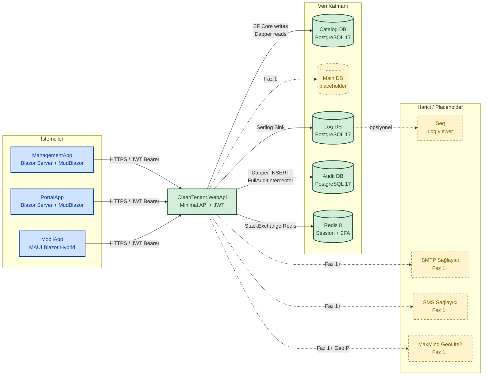
```mermaid
graph LR
    classDef live fill:#d4edda,stroke:#155724,stroke-width:2px,color:#155724
    classDef placeholder fill:#fff3cd,stroke:#856404,stroke-width:1px,color:#856404,stroke-dasharray: 5 5
    classDef client fill:#cfe2ff,stroke:#084298,stroke-width:2px,color:#084298

    subgraph Clients["İstemciler"]
        M[ManagementApp<br/>Blazor Server + MudBlazor]:::client
        P[PortalApp<br/>Blazor Server + MudBlazor]:::client
        Mb[MobilApp<br/>MAUI Blazor Hybrid]:::client
    end

    API[CleanTenant.WebApi<br/>Minimal API + JWT]:::live

    subgraph Data["Veri Katmanı"]
        Cat[(Catalog DB<br/>PostgreSQL 17)]:::live
        Main[(Main DB<br/>placeholder)]:::placeholder
        Log[(Log DB<br/>PostgreSQL 17)]:::live
        Aud[(Audit DB<br/>PostgreSQL 17)]:::live
        R[(Redis 8<br/>Session + 2FA)]:::live
    end

    subgraph External["Harici / Placeholder"]
        Seq[Seq<br/>Log viewer]:::placeholder
        SMTP[SMTP Sağlayıcı<br/>Faz 1+]:::placeholder
        SMS[SMS Sağlayıcı<br/>Faz 1+]:::placeholder
        Geo[MaxMind GeoLite2<br/>Faz 1+]:::placeholder
    end

    M -->|HTTPS / JWT Bearer| API
    P -->|HTTPS / JWT Bearer| API
    Mb -->|HTTPS / JWT Bearer| API

    API -->|EF Core writes<br/>Dapper reads| Cat
    API -.->|Faz 1| Main
    API -->|Serilog Sink| Log
    API -->|Dapper INSERT<br/>FullAuditInterceptor| Aud
    API -->|StackExchange.Redis| R

    Log -.->|opsiyonel| Seq
    API -.->|Faz 1+| SMTP
    API -.->|Faz 1+| SMS
    API -.->|Faz 1+ GeoIP| Geo
```

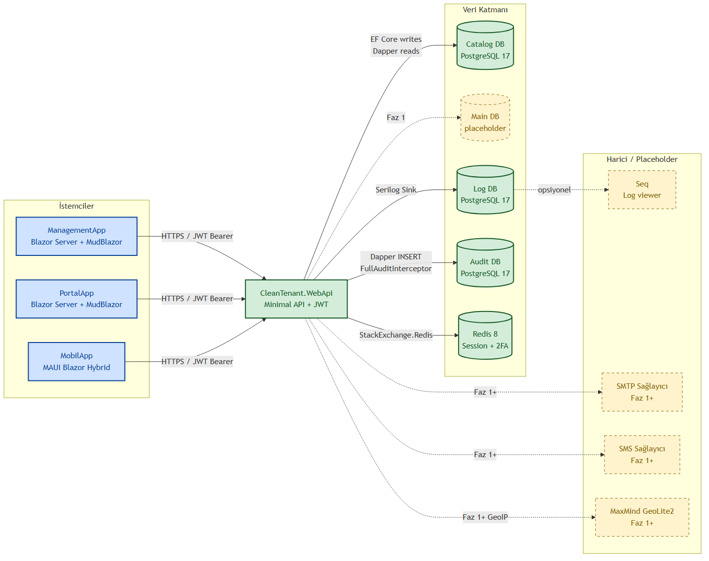

**Notlar:**
- Yeşil kutular Faz 0'da canlı; sarı/kesik kutular Faz 1+'a ertelendi.
- ManagementApp + PortalApp Faz 0'da yalnız scaffold (boş Blazor Server projeleri); MobilApp aynı şekilde scaffold.
- WebApi tek backend giriş noktası; tüm istemciler HTTPS+Bearer ile konuşur.

---

## 2. Proje Bağımlılık Haritası (C4 Level 2)

17 .NET projesi arasında bağımlılık yönleri. Clean Architecture kuralı: bağımlılıklar **içe doğru** akar (Presentation → Infrastructure → Application → Domain → SharedKernel).

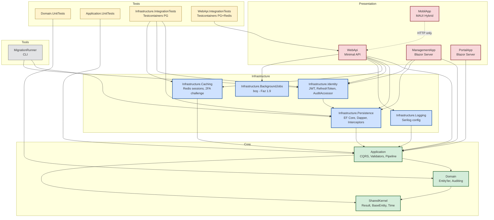
```mermaid
graph TD
    classDef core fill:#d4edda,stroke:#155724,stroke-width:2px
    classDef infra fill:#cfe2ff,stroke:#084298,stroke-width:2px
    classDef pres fill:#f8d7da,stroke:#842029,stroke-width:2px
    classDef tool fill:#e2e3e5,stroke:#41464b,stroke-width:1px
    classDef test fill:#fff3cd,stroke:#856404,stroke-width:1px

    subgraph Core
        SK[SharedKernel<br/>Result, BaseEntity, Time]:::core
        Dom[Domain<br/>Entity'ler, Auditing]:::core
        App[Application<br/>CQRS, Validators, Pipeline]:::core
    end

    subgraph Infrastructure
        Per[Infrastructure.Persistence<br/>EF Core, Dapper, Interceptors]:::infra
        Idn[Infrastructure.Identity<br/>JWT, RefreshToken, AuditAccessor]:::infra
        Cac[Infrastructure.Caching<br/>Redis sessions, 2FA challenge]:::infra
        LogI[Infrastructure.Logging<br/>Serilog config]:::infra
        BG[Infrastructure.BackgroundJobs<br/>boş - Faz 1.9]:::infra
    end

    subgraph Presentation
        Web[WebApi<br/>Minimal API]:::pres
        Mgmt[ManagementApp<br/>Blazor Server]:::pres
        Por[PortalApp<br/>Blazor Server]:::pres
        Mob[MobilApp<br/>MAUI Hybrid]:::pres
    end

    subgraph Tools
        Mig[MigrationRunner<br/>CLI]:::tool
    end

    subgraph Tests
        TDom[Domain.UnitTests]:::test
        TApp[Application.UnitTests]:::test
        TInf[Infrastructure.IntegrationTests<br/>Testcontainers PG]:::test
        TWeb[WebApi.IntegrationTests<br/>Testcontainers PG+Redis]:::test
    end

    Dom --> SK
    App --> Dom
    App --> SK

    Per --> App
    Idn --> Per
    Cac --> App
    LogI --> App

    Web --> App
    Web --> Per
    Web --> Idn
    Web --> Cac
    Web --> LogI
    Web --> BG

    Mgmt --> App
    Mgmt --> Per
    Mgmt --> Idn
    Por --> App

    Mob -.->|HTTP only| Web

    Mig --> Per
    Mig --> Idn

    TDom --> Dom
    TApp --> App
    TInf --> Per
    TInf --> Idn
    TInf --> Cac
    TWeb --> Web
```

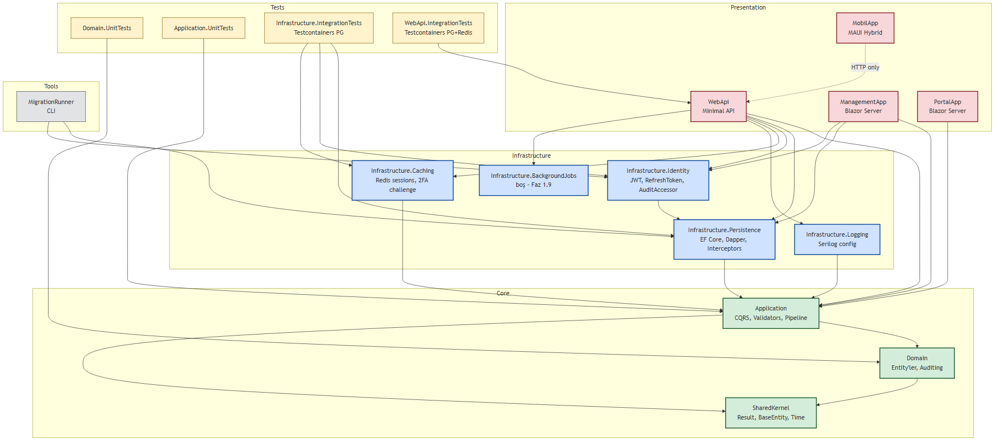

**Önemli detaylar:**
- **MobilApp hiçbir Core/Infrastructure projesine bağlanmaz** — yalnız HTTP üzerinden WebApi ile konuşur. Bu bir mimari karar (v0.1.1'de MAUI/Application namespace çakışmasından sonra netleşti).
- **Infrastructure.BackgroundJobs Faz 0'da boş** — Hangfire v0.1.9'da gelir.
- **Domain'in tek bağımlılığı SharedKernel + ASP.NET Identity** (User : IdentityUser, Role : IdentityRole miras alabilsin diye).
- **Application'ın MediatR + FluentValidation bağımlılığı** v0.1.6'da eklendi.

---

## 3. Clean Architecture Katmanları

Soyutlama düzeyleri ve sorumlulukları.

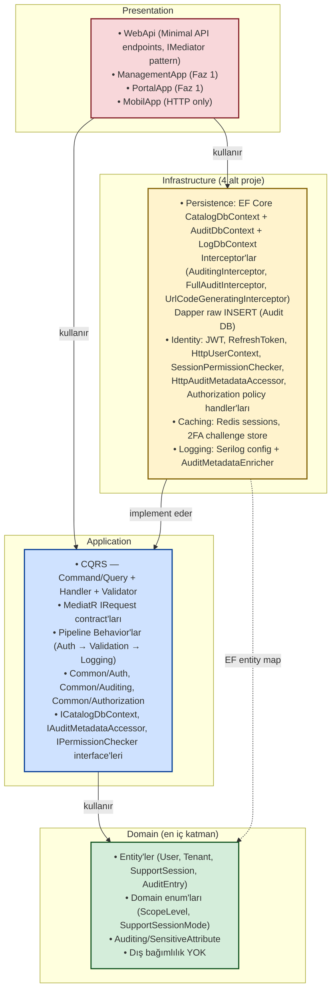
```mermaid
graph TD
    classDef core fill:#d4edda,stroke:#155724,stroke-width:2px
    classDef app fill:#cfe2ff,stroke:#084298,stroke-width:2px
    classDef infra fill:#fff3cd,stroke:#856404,stroke-width:2px
    classDef pres fill:#f8d7da,stroke:#842029,stroke-width:2px

    subgraph "Domain (en iç katman)"
        DomDesc["• Entity'ler (User, Tenant, SupportSession, AuditEntry)<br/>• Domain enum'ları (ScopeLevel, SupportSessionMode)<br/>• Auditing/SensitiveAttribute<br/>• Dış bağımlılık YOK"]:::core
    end

    subgraph "Application"
        AppDesc["• CQRS — Command/Query + Handler + Validator<br/>• MediatR IRequest contract'ları<br/>• Pipeline Behavior'lar (Auth → Validation → Logging)<br/>• Common/Auth, Common/Auditing, Common/Authorization<br/>• ICatalogDbContext, IAuditMetadataAccessor, IPermissionChecker interface'leri"]:::app
    end

    subgraph "Infrastructure (4 alt proje)"
        InfraDesc["• Persistence: EF Core CatalogDbContext + AuditDbContext + LogDbContext<br/>  Interceptor'lar (AuditingInterceptor, FullAuditInterceptor, UrlCodeGeneratingInterceptor)<br/>  Dapper raw INSERT (Audit DB)<br/>• Identity: JWT, RefreshToken, HttpUserContext, SessionPermissionChecker,<br/>  HttpAuditMetadataAccessor, Authorization policy handler'ları<br/>• Caching: Redis sessions, 2FA challenge store<br/>• Logging: Serilog config + AuditMetadataEnricher"]:::infra
    end

    subgraph "Presentation"
        PresDesc["• WebApi (Minimal API endpoints, IMediator pattern)<br/>• ManagementApp (Faz 1)<br/>• PortalApp (Faz 1)<br/>• MobilApp (HTTP only)"]:::pres
    end

    PresDesc -->|kullanır| InfraDesc
    PresDesc -->|kullanır| AppDesc
    InfraDesc -->|implement eder| AppDesc
    AppDesc -->|kullanır| DomDesc
    InfraDesc -.->|EF entity map| DomDesc
```

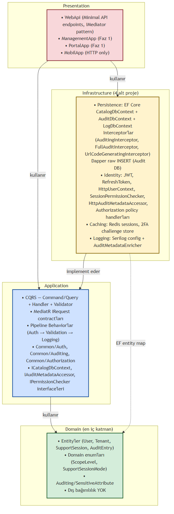

**Önemli sorumluluklar:**

- **Domain** ([User.cs](../../../src/Core/CleanTenant.Domain/Identity/Users/User.cs), [AuditEntry.cs](../../../src/Core/CleanTenant.Domain/Auditing/AuditEntry.cs)): Sadece veri + iş kuralları. Hiç DI, IoC, HTTP, framework bilgisi yok.

- **Application** ([LoginCommandHandler.cs](../../../src/Core/CleanTenant.Application/Features/Auth/Login/LoginCommandHandler.cs), [AuthorizationBehavior.cs](../../../src/Core/CleanTenant.Application/Common/Pipeline/AuthorizationBehavior.cs)): Use-case orchestration. Sadece interface'lere bağımlı (ICatalogDbContext, IPermissionChecker vb).

- **Infrastructure** ([FullAuditInterceptor.cs](../../../src/Infrastructure/CleanTenant.Infrastructure.Persistence/Interceptors/FullAuditInterceptor.cs), [RedisAuthSessionStore.cs](../../../src/Infrastructure/CleanTenant.Infrastructure.Caching/Sessions/RedisAuthSessionStore.cs)): Concrete implementasyonlar — EF Core, Dapper, StackExchange.Redis, Serilog.

- **Presentation** ([AuthEndpoints.cs](../../../src/Presentation/CleanTenant.WebApi/Endpoints/AuthEndpoints.cs)): HTTP/Blazor wiring; iş mantığı yok, sadece `IMediator.Send` çağrısı.

---

## 4. Catalog DB — ER Diyagramı

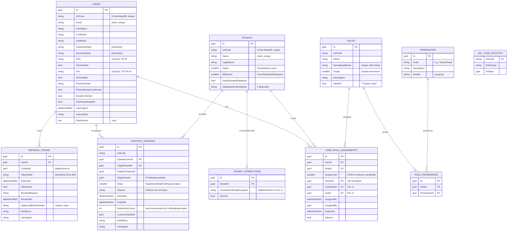
```mermaid
erDiagram
    USERS ||--o{ USER_ROLE_ASSIGNMENTS : "has"
    USERS ||--o{ REFRESH_TOKENS : "owns"
    USERS ||--o{ SUPPORT_SESSIONS : "as operator"

    TENANTS ||--o{ USER_ROLE_ASSIGNMENTS : "scope"
    TENANTS ||--o| TENANT_CONNECTIONS : "(if dedicated DB)"
    TENANTS ||--o{ SUPPORT_SESSIONS : "as target"

    ROLES ||--o{ USER_ROLE_ASSIGNMENTS : "assigned"
    ROLES ||--o{ ROLE_PERMISSIONS : "grants"
    PERMISSIONS ||--o{ ROLE_PERMISSIONS : "granted by"

    USERS {
        guid Id PK
        string UrlCode "9-char Base58, unique"
        string Email "citext, unique"
        string UserName
        string FirstName
        string LastName
        string PasswordHash "[Sensitive]"
        string SecurityStamp "[Sensitive]"
        string Tckn "char(11), TR ID"
        bool TcknVerified
        string Vkn "char(10), TR Tax ID"
        bool VknVerified
        string PhoneNumber
        bool PhoneNumberConfirmed
        bool EmailConfirmed
        bool TwoFactorEnabled
        datetimeoffset LastLoginAt
        string LastLoginIp
        uint RowVersion "xmin"
    }

    TENANTS {
        guid Id PK
        string UrlCode "9-char Base58, unique"
        string Name "citext, unique"
        string LegalName
        smallint Status "TenantStatus enum"
        smallint BillingTier "Free/Standard/Enterprise"
        bool HasDedicatedDatabase
        string DatabaseSchemaName "if dedicated"
    }

    TENANT_CONNECTIONS {
        guid Id PK
        guid TenantId FK
        string ConnectionStringEncrypted "DataProtection in Faz 1+"
        bool IsActive
    }

    ROLES {
        guid Id PK
        string UrlCode
        string Name
        string NormalizedName "unique with Scope"
        smallint Scope "ScopeLevel enum"
        string Description
        bool IsBuiltIn "7 System roles"
    }

    PERMISSIONS {
        guid Id PK
        string Code "e.g. Tenant.Read"
        string Description
        string Module "grouping"
    }

    ROLE_PERMISSIONS {
        guid Id PK
        guid RoleId FK
        guid PermissionId FK
    }

    USER_ROLE_ASSIGNMENTS {
        guid Id PK
        guid UserId FK
        guid RoleId FK
        smallint ScopeLevel "CHECK enforces cardinality"
        guid TenantId FK "null at System"
        guid CompanyId FK "Faz 1+"
        guid UnitId FK "Faz 1+"
        datetimeoffset AssignedAt
        guid AssignedBy
        datetimeoffset ExpiresAt
        bool IsActive
    }

    REFRESH_TOKENS {
        guid Id PK
        guid UserId FK
        guid ContextId "tab/persona id"
        string TokenHash "[Sensitive] SHA-256"
        datetimeoffset ExpiresAt
        bool IsRevoked
        string RevokedReason
        datetimeoffset RevokedAt
        string ReplacedByTokenHash "rotation chain"
        string IpAddress
        string UserAgent
    }

    SUPPORT_SESSIONS {
        guid Id PK
        string UrlCode
        guid OperatorUserId FK
        guid TargetTenantId FK
        guid TargetCompanyId
        guid TargetUserId "if FullImpersonation"
        smallint Mode "ReadOnly/Write/FullImpersonation"
        string Reason "CHECK min 20 chars"
        datetimeoffset StartedAt
        datetimeoffset EndedAt
        int WriteActionCount "auto-incremented by FullAuditInterceptor"
        bool CustomerNotified
        string IpAddress
        string UserAgent
    }

    URL_CODE_REGISTRY {
        string UrlCode PK
        string EntityType
        guid EntityId
    }
```

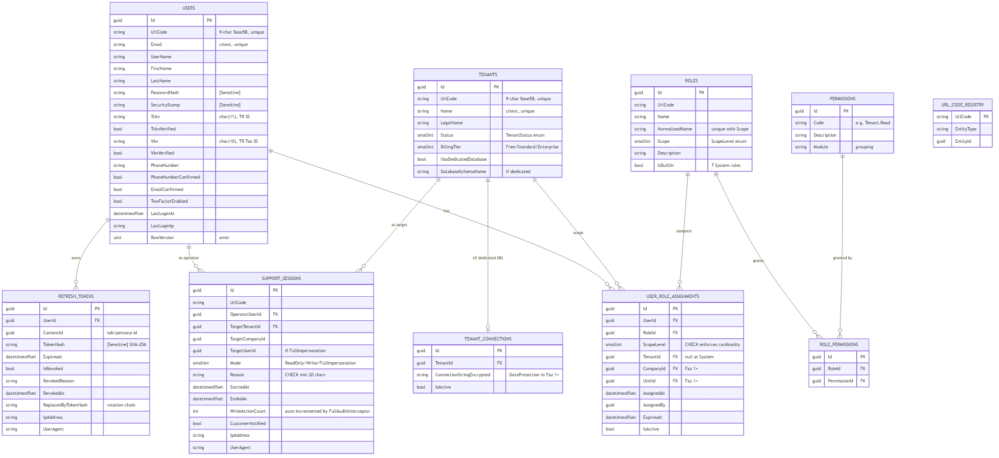

**Önemli özellikler:**

- **`USER_ROLE_ASSIGNMENTS` CHECK constraint** — `ScopeLevel`'ın cardinality kuralı: System'de `TenantId/CompanyId/UnitId` hepsi null; Tenant'ta yalnız `TenantId` dolu vb. v0.1.4.a migration.
- **`SUPPORT_SESSIONS.Reason` CHECK** — minimum 20 karakter (DB-level enforcement).
- **`USERS.Tckn` (TR Kimlik) + `USERS.Vkn` (TR Vergi)** — login identifier olarak destekleniyor; `TcknVerified=true` ve `VknVerified=true` şartı.
- **`REFRESH_TOKENS.ReplacedByTokenHash` rotation chain** — refresh token replay tespiti için.
- **`xmin` → uint `RowVersion`** — PostgreSQL sistem sütununa optimistic concurrency için map.
- **AspNet Identity standart tabloları** (`AspNetUserClaims`, `AspNetUserLogins`, `AspNetUserTokens` vb.) — `User` ve `Role` `IdentityUser/Role`'dan miras aldığı için var; bu diyagramda gösterilmedi.

---

## 5. Audit DB — ER Diyagramı

Tek tablo, 35+ denormalize alan. Kullanıcı + zaman + environment + lokasyon + request + değişiklik bilgileri her satıra kopyalanır → cross-tenant analitikte join gerektirmez.

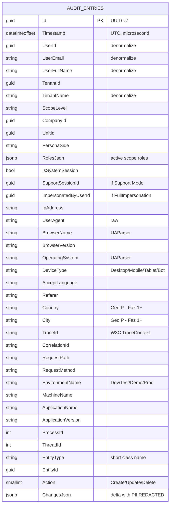
```mermaid
erDiagram
    AUDIT_ENTRIES {
        guid Id PK "UUID v7"
        datetimeoffset Timestamp "UTC, microsecond"
        guid UserId "denormalize"
        string UserEmail "denormalize"
        string UserFullName "denormalize"
        guid TenantId
        string TenantName "denormalize"
        string ScopeLevel
        guid CompanyId
        guid UnitId
        string PersonaSide
        jsonb RolesJson "active scope roles"
        bool IsSystemSession
        guid SupportSessionId "if Support Mode"
        guid ImpersonatedByUserId "if FullImpersonation"
        string IpAddress
        string UserAgent "raw"
        string BrowserName "UAParser"
        string BrowserVersion
        string OperatingSystem "UAParser"
        string DeviceType "Desktop/Mobile/Tablet/Bot"
        string AcceptLanguage
        string Referer
        string Country "GeoIP - Faz 1+"
        string City "GeoIP - Faz 1+"
        string TraceId "W3C TraceContext"
        string CorrelationId
        string RequestPath
        string RequestMethod
        string EnvironmentName "Dev/Test/Demo/Prod"
        string MachineName
        string ApplicationName
        string ApplicationVersion
        int ProcessId
        int ThreadId
        string EntityType "short class name"
        guid EntityId
        smallint Action "Create/Update/Delete"
        jsonb ChangesJson "delta with PII REDACTED"
    }
```

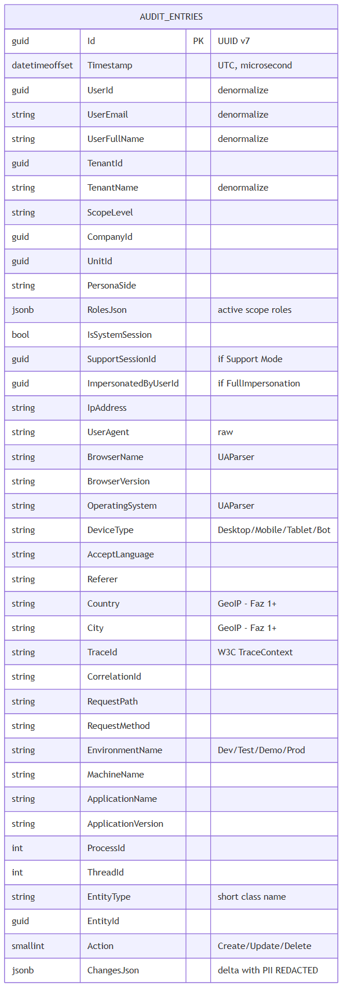

**İndeksler (sorgu hızı):**

| İndeks | Amaç |
|---|---|
| `(tenant_id, timestamp DESC)` | Tenant Admin "son 30 gün benim tenant'ım için ne oldu" |
| `(entity_type, entity_id)` | Bir entity'nin tüm geçmişi (audit trail) |
| `support_session_id` (partial WHERE NOT NULL) | Support Mode oturumlarına bağlı tüm yazımlar |
| (Faz 1+) jsonb GIN on `changes_json` | Property-level delta arama |

**Yazım stratejisi:** EF Core değil **Dapper raw INSERT** ile [FullAuditInterceptor.cs](../../../src/Infrastructure/CleanTenant.Infrastructure.Persistence/Interceptors/FullAuditInterceptor.cs). Catalog SaveChanges başarılı olduktan **sonra** yazılır (atomic-ish: data yazılmadan audit yazılmaz). Catalog fail → audit yazılmaz.

---

## 6. Log DB — Şema

Serilog PostgreSQL Sink yazar; uygulama doğrudan yazmaz.

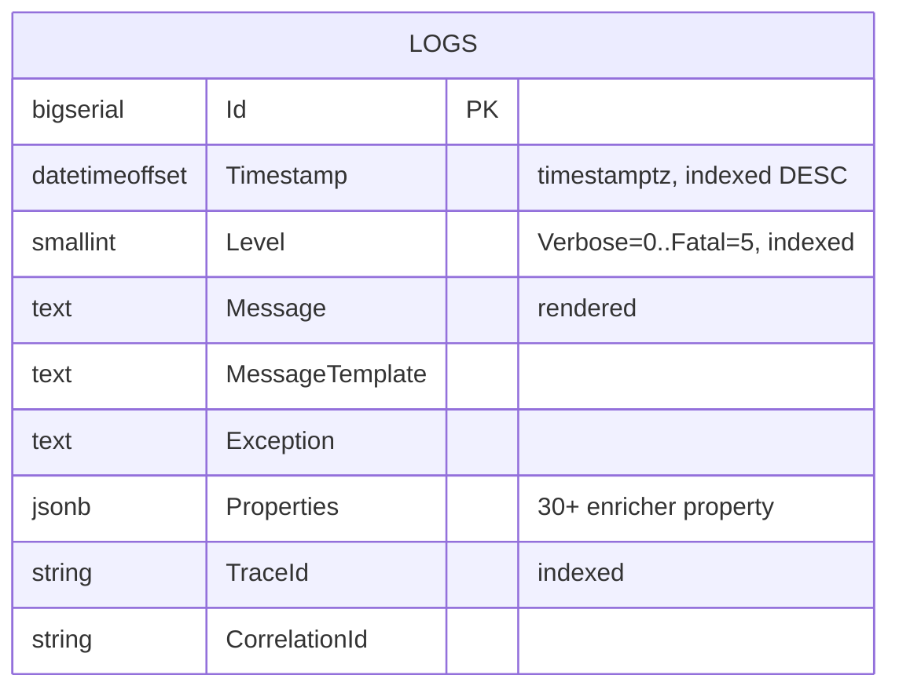
```mermaid
erDiagram
    LOGS {
        bigserial Id PK
        datetimeoffset Timestamp "timestamptz, indexed DESC"
        smallint Level "Verbose=0..Fatal=5, indexed"
        text Message "rendered"
        text MessageTemplate
        text Exception
        jsonb Properties "30+ enricher property"
        string TraceId "indexed"
        string CorrelationId
    }
```

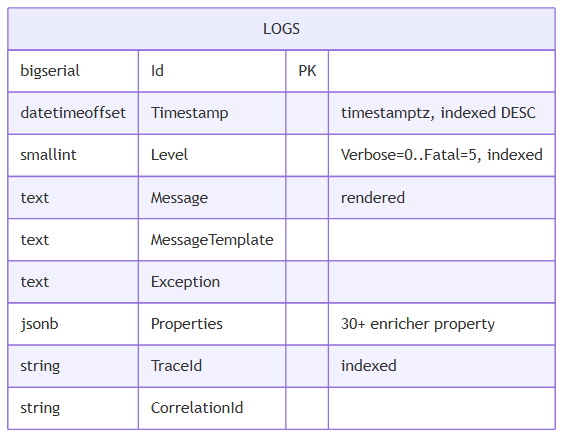

**`properties` jsonb içeriği (AuditMetadataEnricher tarafından):**

- **Kullanıcı:** `UserId`, `UserEmail`, `UserFullName`, `TenantId`, `TenantName`, `ScopeLevel`, `CompanyId`, `UnitId`, `PersonaSide`, `Roles`, `IsSystemSession`, `SupportSessionId`, `ImpersonatedByUserId`.
- **Lokasyon:** `IpAddress`, `UserAgent`, `BrowserName`, `BrowserVersion`, `OperatingSystem`, `DeviceType`, `AcceptLanguage`, `Referer`.
- **Request:** `TraceIdRequest`, `CorrelationId`, `RequestPath`, `RequestMethod`.
- **Environment:** `EnvironmentName`, `MachineName`, `ApplicationName`, `ApplicationVersion`, `ProcessId`, `ThreadId`.

Sonuç: Audit DB ile log DB **bilgi olarak eş zenginlikte**. Audit DB "iş durumu değişikliği" log DB "her olay" tutar.

---

## 7. Hibrit JWT + Redis Session Mimarisi

Saf stateless JWT yerine **thin JWT (sadece referans) + Redis session (yetki dolusu)**. Sektör pratiği (Stripe/GitHub/Auth0 benzeri).

**JWT içeriği (~250 byte):** yalnız `sub`, `sid`, `ctx`, `iat`, `exp`, `iss`, `aud`.
**Redis session:** roller, permission'lar, scope, persona, IsSystemSession, SupportSessionId.

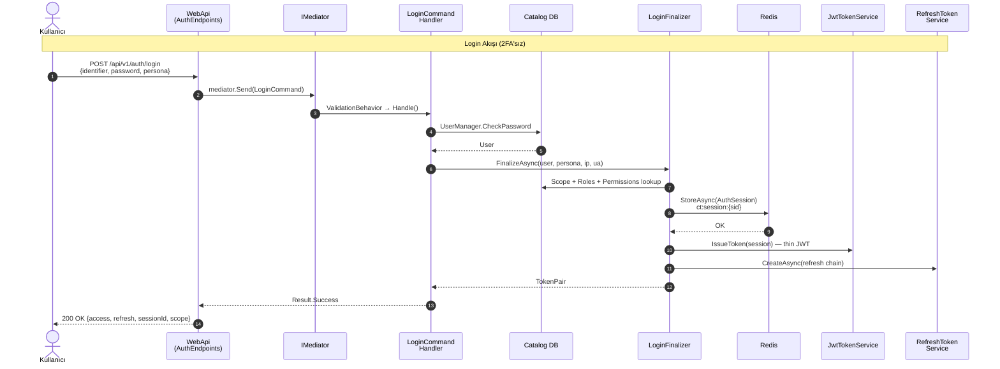
```mermaid
sequenceDiagram
    autonumber
    actor U as Kullanıcı
    participant API as WebApi<br/>(AuthEndpoints)
    participant Med as IMediator
    participant LH as LoginCommand<br/>Handler
    participant DB as Catalog DB
    participant Fin as LoginFinalizer
    participant R as Redis
    participant JS as JwtTokenService
    participant RT as RefreshToken<br/>Service

    Note over U,RT: Login Akışı (2FA'sız)
    U->>API: POST /api/v1/auth/login<br/>{identifier, password, persona}
    API->>Med: mediator.Send(LoginCommand)
    Med->>LH: ValidationBehavior → Handle()
    LH->>DB: UserManager.CheckPassword
    DB-->>LH: User
    LH->>Fin: FinalizeAsync(user, persona, ip, ua)
    Fin->>DB: Scope + Roles + Permissions lookup
    Fin->>R: StoreAsync(AuthSession)<br/>ct:session:{sid}
    R-->>Fin: OK
    Fin->>JS: IssueToken(session) — thin JWT
    Fin->>RT: CreateAsync(refresh chain)
    Fin-->>LH: TokenPair
    LH-->>API: Result.Success
    API-->>U: 200 OK {access, refresh, sessionId, scope}
```

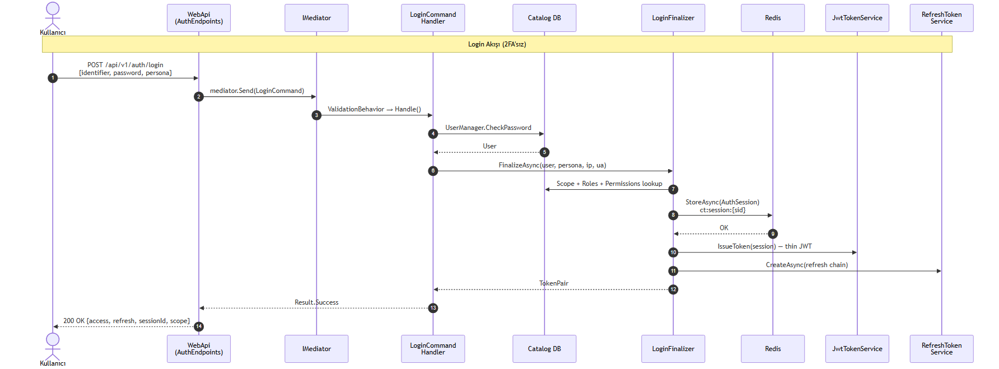

**Sliding TTL davranışı:** Her HTTP isteğinde [SessionLookupMiddleware.cs](../../../src/Infrastructure/CleanTenant.Infrastructure.Identity/Middleware/SessionLookupMiddleware.cs) Redis'ten session okur, yoksa **401**. Varsa `LastActivity` güncellenir, TTL yenilenir.

**Anlık revocation:** Rol/permission değişimi → Redis session güncellenir → sonraki istek anında yeni yetkilerle.

---

## 8. Login + 2FA Akışı

Login response polimorfik: ya `TokenPair` döner (Status="Success") ya da `TwoFactorChallengeResponse` (Status="TwoFactorRequired").

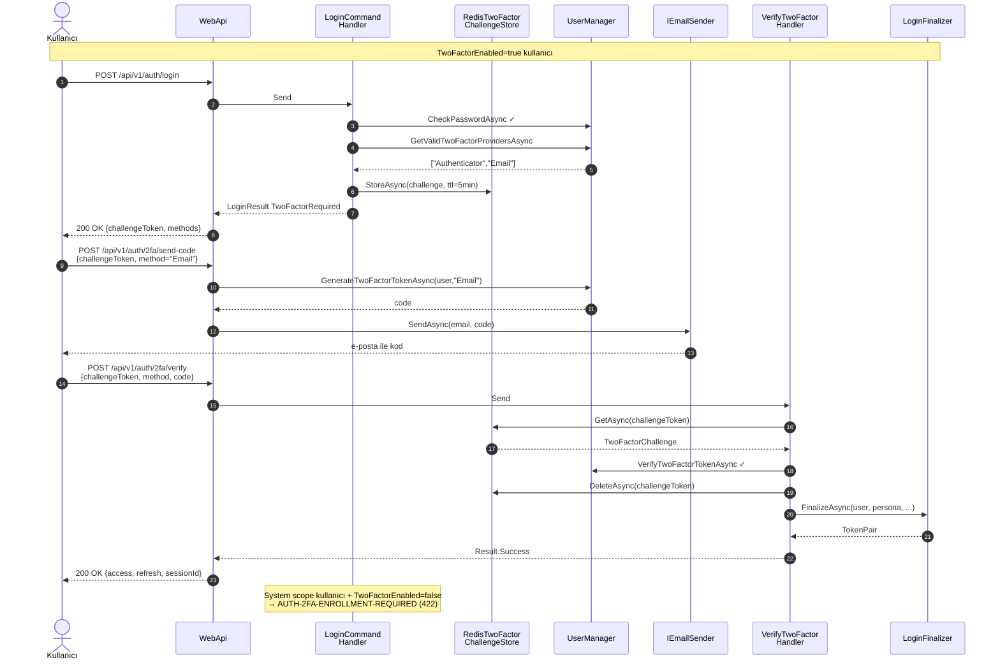
```mermaid
sequenceDiagram
    autonumber
    actor U as Kullanıcı
    participant API as WebApi
    participant LH as LoginCommand<br/>Handler
    participant CS as RedisTwoFactor<br/>ChallengeStore
    participant UM as UserManager
    participant ES as IEmailSender
    participant VH as VerifyTwoFactor<br/>Handler
    participant Fin as LoginFinalizer

    Note over U,Fin: TwoFactorEnabled=true kullanıcı
    U->>API: POST /api/v1/auth/login
    API->>LH: Send
    LH->>UM: CheckPasswordAsync ✓
    LH->>UM: GetValidTwoFactorProvidersAsync
    UM-->>LH: ["Authenticator","Email"]
    LH->>CS: StoreAsync(challenge, ttl=5min)
    LH-->>API: LoginResult.TwoFactorRequired
    API-->>U: 200 OK {challengeToken, methods}

    U->>API: POST /api/v1/auth/2fa/send-code<br/>{challengeToken, method="Email"}
    API->>UM: GenerateTwoFactorTokenAsync(user,"Email")
    UM-->>API: code
    API->>ES: SendAsync(email, code)
    ES-->>U: e-posta ile kod

    U->>API: POST /api/v1/auth/2fa/verify<br/>{challengeToken, method, code}
    API->>VH: Send
    VH->>CS: GetAsync(challengeToken)
    CS-->>VH: TwoFactorChallenge
    VH->>UM: VerifyTwoFactorTokenAsync ✓
    VH->>CS: DeleteAsync(challengeToken)
    VH->>Fin: FinalizeAsync(user, persona, ...)
    Fin-->>VH: TokenPair
    VH-->>API: Result.Success
    API-->>U: 200 OK {access, refresh, sessionId}

    Note over LH: System scope kullanıcı + TwoFactorEnabled=false<br/>→ AUTH-2FA-ENROLLMENT-REQUIRED (422)
```

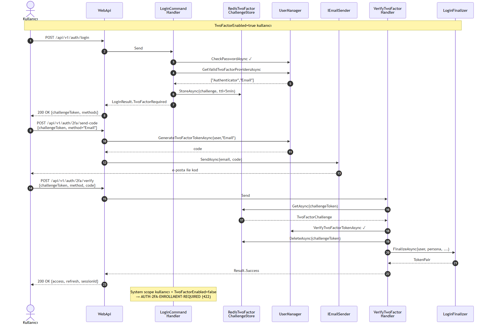

**Önemli detaylar:**

- **System kullanıcı + 2FA enrolled değil** → `AUTH-2FA-ENROLLMENT-REQUIRED` (422). Önce TOTP/Email/SMS yöntemlerinden birini enroll etmeli.
- **Authenticator (TOTP) sunucu kod üretmez** — secret yalnız kullanıcı app'inde. Sunucu sadece `VerifyTwoFactorTokenAsync` ile doğrular.
- **Recovery code akışı** — `/2fa/verify` method="RecoveryCode" ile gönderilir; her kod tek kullanımlık.
- **Challenge token tek kullanımlık** — doğrulamadan sonra silinir (replay engelleme).

---

## 9. Multi-Scope + Persona Geçiş Durumları

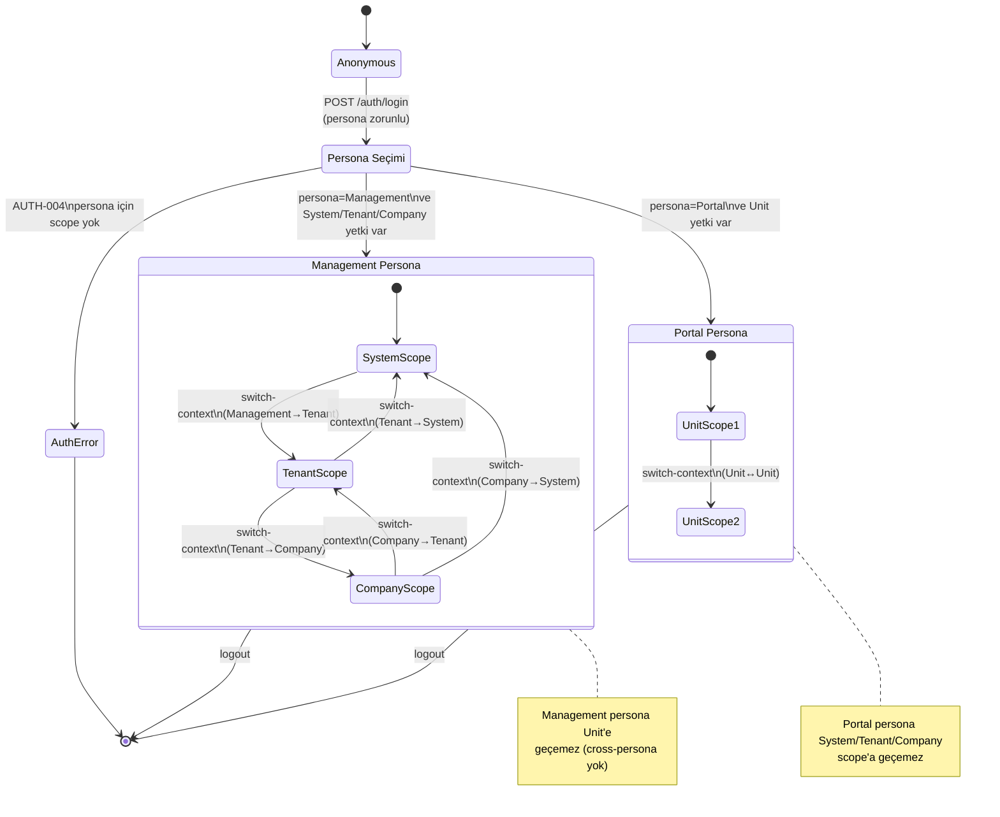
```mermaid
stateDiagram-v2
    [*] --> Anonymous

    state "Persona Seçimi" as Pers
    Anonymous --> Pers: POST /auth/login<br/>(persona zorunlu)

    state "Management Persona" as Mgmt {
        [*] --> SystemScope
        SystemScope --> TenantScope: switch-context\n(Management→Tenant)
        TenantScope --> SystemScope: switch-context\n(Tenant→System)
        TenantScope --> CompanyScope: switch-context\n(Tenant→Company)
        CompanyScope --> TenantScope: switch-context\n(Company→Tenant)
        CompanyScope --> SystemScope: switch-context\n(Company→System)
    }

    state "Portal Persona" as Portal {
        [*] --> UnitScope1
        UnitScope1 --> UnitScope2: switch-context\n(Unit↔Unit)
    }

    Pers --> Mgmt: persona=Management\nve System/Tenant/Company yetki var
    Pers --> Portal: persona=Portal\nve Unit yetki var
    Pers --> AuthError: AUTH-004\npersona için scope yok

    Mgmt --> [*]: logout
    Portal --> [*]: logout
    AuthError --> [*]

    note right of Mgmt
        Management persona Unit'e
        geçemez (cross-persona yok)
    end note

    note right of Portal
        Portal persona System/Tenant/Company
        scope'a geçemez
    end note
```

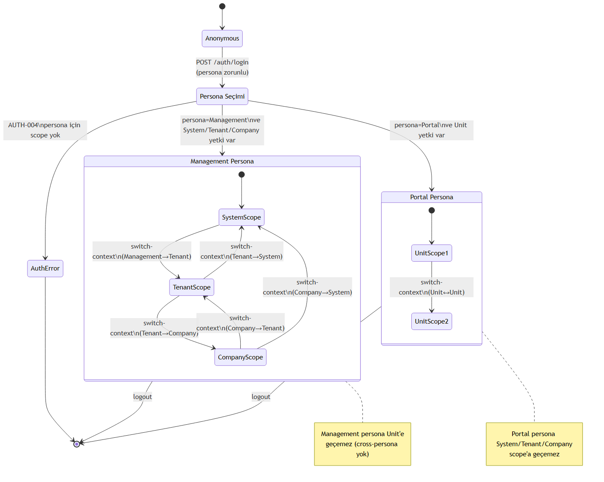

**Güvenlik sınırı (sıkı):**

- **Unit kullanıcı (Malik/Hissedar/Sakin/Kiracı) ManagementApp'ten login olamaz.** Persona=Management ise Unit atamaları `availableScopes`'a dahil edilmez.
- **System/Tenant/Company kullanıcı PortalApp'ten login olamaz.** Persona=Portal sabit; Unit dışı scope görünmez.
- Bir kullanıcının her iki tarafta yetkisi olabilir; hangi uygulamadan login olduğu hangi scope'ları göreceğini belirler.

---

## 10. Support Mode State Diyagramı

System operatörünün bir tenant'a destek amaçlı girişi. Tasarım kararı: **Enter / Exit / Impersonate** yeni JWT, **Elevate** in-place mutation (JWT yenilenmez).

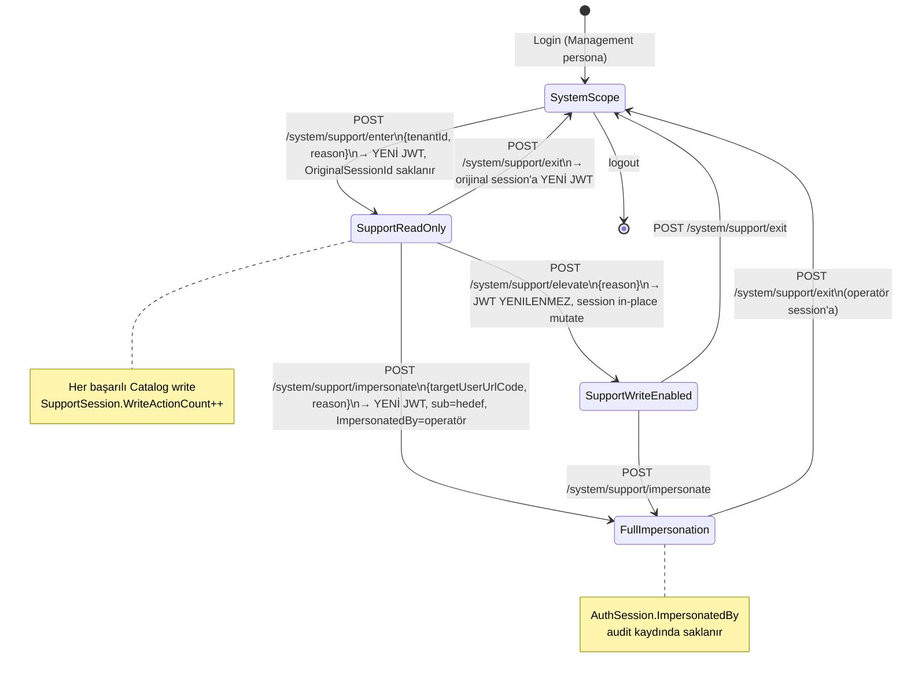
```mermaid
stateDiagram-v2
    [*] --> SystemScope: Login (Management persona)

    SystemScope --> SupportReadOnly: POST /system/support/enter\n{tenantId, reason}\n→ YENİ JWT, OriginalSessionId saklanır

    SupportReadOnly --> SupportWriteEnabled: POST /system/support/elevate\n{reason}\n→ JWT YENILENMEZ, session in-place mutate

    SupportReadOnly --> FullImpersonation: POST /system/support/impersonate\n{targetUserUrlCode, reason}\n→ YENİ JWT, sub=hedef, ImpersonatedBy=operatör
    SupportWriteEnabled --> FullImpersonation: POST /system/support/impersonate

    SupportReadOnly --> SystemScope: POST /system/support/exit\n→ orijinal session'a YENİ JWT
    SupportWriteEnabled --> SystemScope: POST /system/support/exit
    FullImpersonation --> SystemScope: POST /system/support/exit\n(operatör session'a)

    SystemScope --> [*]: logout

    note right of SupportReadOnly
        Her başarılı Catalog write
        SupportSession.WriteActionCount++
    end note

    note right of FullImpersonation
        AuthSession.ImpersonatedBy
        audit kaydında saklanır
    end note
```

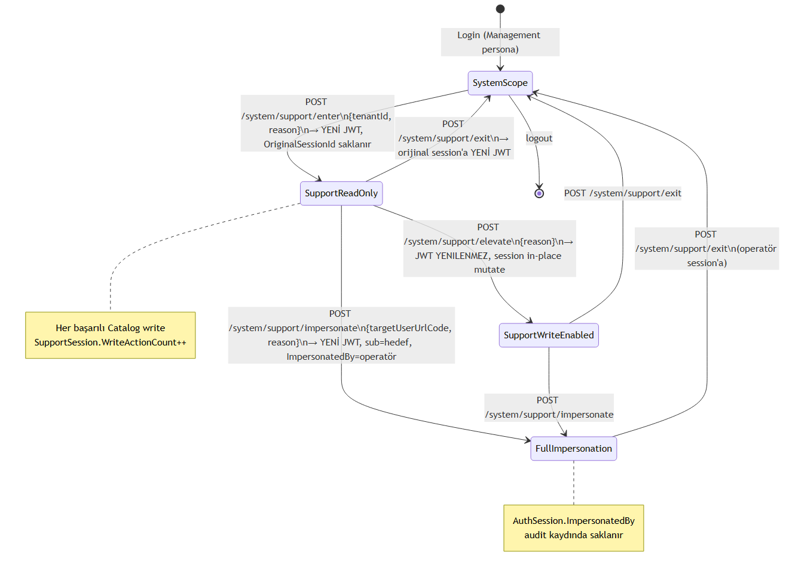

**Önemli detaylar:**

- **Reason zorunlu (min 20 char)** — Enter, Elevate, Impersonate, ForceLogoutUser, RevokeSession hepsi (DB CHECK + FluentValidator).
- **WriteActionCount** — FullAuditInterceptor her Catalog write sonrası artırır (v0.1.7'de v0.1.5.b.2 açık konusu kapandı).
- **Şeffaflık** — Tenant Admin `/api/v1/tenant/audit/support-access` ile kendi tenant'ına yapılan destek erişimlerini görür.

---

## 11. MediatR Pipeline Akışı

v0.1.6'da tanıtıldı. Her command/query 3 behavior'dan geçer (Auth → Validation → Logging) sonra Handler.

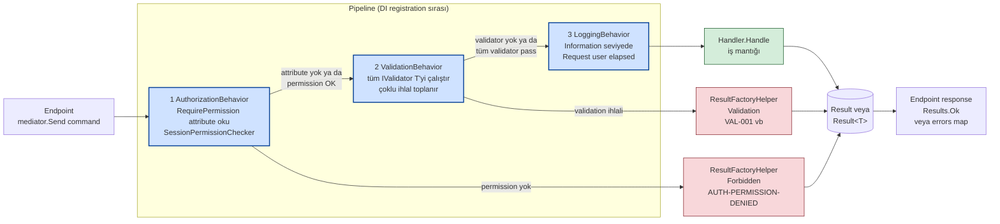
```mermaid
flowchart LR
    classDef behave fill:#cfe2ff,stroke:#084298,stroke-width:2px
    classDef error fill:#f8d7da,stroke:#842029,stroke-width:1px
    classDef success fill:#d4edda,stroke:#155724,stroke-width:1px

    EP[Endpoint<br/>mediator.Send command] --> AB

    subgraph Pipeline["Pipeline (DI registration sırası)"]
        AB[1 AuthorizationBehavior<br/>RequirePermission attribute oku<br/>SessionPermissionChecker]:::behave
        VB[2 ValidationBehavior<br/>tüm IValidator T'yi çalıştır<br/>çoklu ihlal toplanır]:::behave
        LB[3 LoggingBehavior<br/>Information seviyede<br/>Request user elapsed]:::behave
    end

    H[Handler.Handle<br/>iş mantığı]:::success
    R[(Result veya<br/>Result&lt;T&gt;)]

    AB -->|attribute yok ya da<br/>permission OK| VB
    AB -->|permission yok| F1[ResultFactoryHelper<br/>Forbidden<br/>AUTH-PERMISSION-DENIED]:::error
    VB -->|validator yok ya da<br/>tüm validator pass| LB
    VB -->|validation ihlali| F2[ResultFactoryHelper<br/>Validation<br/>VAL-001 vb]:::error
    LB --> H
    H --> R
    F1 --> R
    F2 --> R
    R --> EPR[Endpoint response<br/>Results.Ok<br/>veya errors map]
```

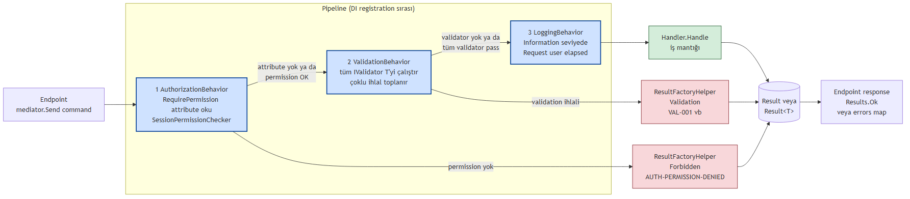

**Pipeline sırası — neden bu sıra?**

1. **Authorization önce** — yetkisiz kullanıcıya validation hata mesajı bile dönmesin (bilgi sızıntısı engelleme).
2. **Validation ikinci** — input formatını kontrol et; **tüm ihlaller toplanır** (form UX için kullanıcı dostu).
3. **Logging üçüncü** — handler etrafında timing; `Information` seviyede `MediatR {Request} user={UserId} elapsed={ms}ms`. Payload **loglanmaz** (PII riski).

**`[RequirePermission(...)]` attribute** — şu an handler'lara konmadı (altyapı hazır, Faz 1 ManagementApp rol-permission map'i ile birlikte serpilecek).

---

## 12. Audit + Log Akışı

İki paralel akış: Catalog SaveChanges → audit kaydı (FullAuditInterceptor) **ve** her log çağrısı → enricher zinciri (AuditMetadataEnricher).

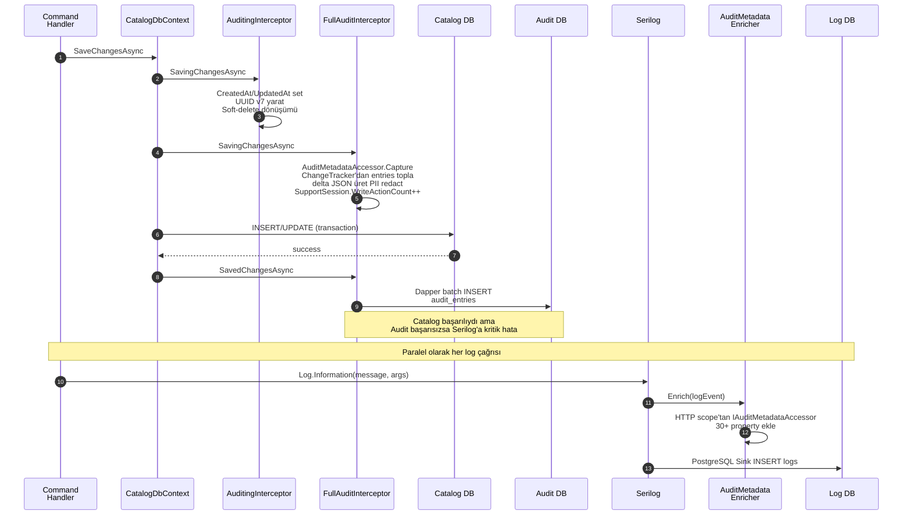
```mermaid
sequenceDiagram
    autonumber
    participant H as Command<br/>Handler
    participant Cat as CatalogDbContext
    participant AI as AuditingInterceptor
    participant FI as FullAuditInterceptor
    participant DB as Catalog DB
    participant Aud as Audit DB
    participant SL as Serilog
    participant En as AuditMetadata<br/>Enricher
    participant Log as Log DB

    H->>Cat: SaveChangesAsync
    Cat->>AI: SavingChangesAsync
    AI->>AI: CreatedAt/UpdatedAt set<br/>UUID v7 yarat<br/>Soft-delete dönüşümü
    Cat->>FI: SavingChangesAsync
    FI->>FI: AuditMetadataAccessor.Capture<br/>ChangeTracker'dan entries topla<br/>delta JSON üret PII redact<br/>SupportSession.WriteActionCount++

    Cat->>DB: INSERT/UPDATE (transaction)
    DB-->>Cat: success

    Cat->>FI: SavedChangesAsync
    FI->>Aud: Dapper batch INSERT<br/>audit_entries

    Note over FI,Aud: Catalog başarılıydı ama<br/>Audit başarısızsa Serilog'a kritik hata

    Note over H,Log: Paralel olarak her log çağrısı
    H->>SL: Log.Information(message, args)
    SL->>En: Enrich(logEvent)
    En->>En: HTTP scope'tan IAuditMetadataAccessor<br/>30+ property ekle
    SL->>Log: PostgreSQL Sink INSERT logs
```

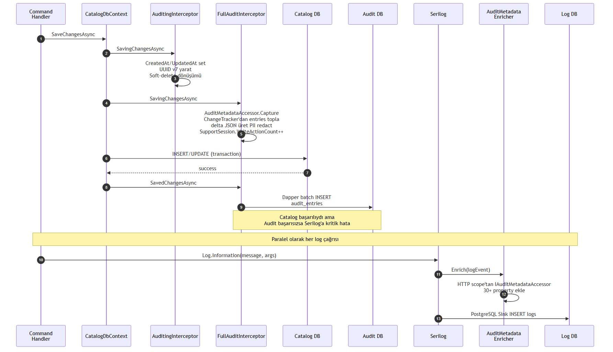

**Atomic kararı:**

- Catalog SaveChanges başarılı olmadan audit yazılmaz (SavedChangesAsync olmaz).
- Audit DB başarısız ise → Serilog kritik hata yazar; Catalog değişiklikleri commit edilmiştir, retry mekanizması Faz 1+'da Hangfire outbox ile gelir.

**PII Redaction:**

- `[Sensitive]` attribute (Domain) — `RefreshToken.TokenHash` gibi kendi alanlar.
- Merkezi liste — `PasswordHash`, `SecurityStamp`, `ConcurrencyStamp`, `TokenHash`, `RefreshTokenHash`, `AuthenticatorKey` (IdentityUser miras alındığı için attribute eklenemiyor).
- `changes_json`'da bu alanların değeri `"[REDACTED]"`.

---

## 13. Endpoint Kataloğu

21 route, 7 endpoint dosyası.

| # | Method | Path | Policy | Handler / Komut |
|---|---|---|---|---|
| 1 | GET | `/health` | AllowAnonymous | HealthEndpoints |
| 2 | POST | `/api/v1/auth/login` | AllowAnonymous | `LoginCommand` |
| 3 | POST | `/api/v1/auth/refresh` | AllowAnonymous | `RefreshTokenCommand` |
| 4 | POST | `/api/v1/auth/logout` | RequireAuthorization | `LogoutCommand` |
| 5 | POST | `/api/v1/auth/switch-context` | RequireAuthorization | `SwitchContextCommand` |
| 6 | POST | `/api/v1/users/me/sessions/logout-all` | RequireAuthorization | `LogoutAllSessionsCommand` |
| 7 | POST | `/api/v1/auth/2fa/verify` | AllowAnonymous (challenge token) | `VerifyTwoFactorCommand` |
| 8 | POST | `/api/v1/auth/2fa/send-code` | AllowAnonymous (challenge token) | `SendTwoFactorCodeCommand` |
| 9 | POST | `/api/v1/auth/2fa/enroll/totp` | RequireAuthorization | `EnrollTotpCommand` |
| 10 | POST | `/api/v1/auth/2fa/enroll/totp/confirm` | RequireAuthorization | `ConfirmTotpEnrollmentCommand` |
| 11 | POST | `/api/v1/auth/2fa/disable/totp` | RequireAuthorization | `DisableTotpCommand` |
| 12 | POST | `/api/v1/auth/2fa/recovery-codes/regenerate` | RequireAuthorization | `RegenerateRecoveryCodesCommand` |
| 13 | GET | `/api/v1/auth/2fa/methods` | RequireAuthorization | `GetTwoFactorMethodsQuery` |
| 14 | POST | `/api/v1/users/{userUrlCode}/force-logout` | TenantScope | `ForceLogoutUserCommand` |
| 15 | POST | `/api/v1/system/sessions/{sessionId}/revoke` | SystemScope | `RevokeSessionCommand` |
| 16 | POST | `/api/v1/system/support/enter` | SystemScope | `EnterSupportModeCommand` |
| 17 | POST | `/api/v1/system/support/exit` | SupportModeActive | `ExitSupportModeCommand` |
| 18 | POST | `/api/v1/system/support/elevate` | SupportModeActive | `ElevateToWriteCommand` |
| 19 | POST | `/api/v1/system/support/impersonate` | SupportModeActive | `ImpersonateUserCommand` |
| 20 | GET | `/api/v1/system/support-sessions` | SystemScope | `GetSystemSupportSessionsQuery` |
| 21 | GET | `/api/v1/tenant/audit/support-access` | TenantScope | `GetTenantSupportAccessQuery` |

**Yetki politikaları:**

- **AllowAnonymous** (3 + 2 + health = 6) — login akışı + 2FA challenge akışı + health check.
- **RequireAuthorization** (7) — kimlik doğrulanmış kullanıcı yeterli (ek yetki yok).
- **SystemScope** (3) — `ICurrentSessionAccessor.ScopeLevel == System`.
- **TenantScope** (3) — `Tenant`, `Company`, `Unit` seviyelerinden biri.
- **SupportModeActive** (3) — `IsSystemSession=true` ve `SupportMode ∈ {ReadOnly, WriteEnabled, FullImpersonation}`.
- **SupportWriteEnabled** (0 — şu an handler kullanmıyor; policy hazır, ileride yazma korumalı endpoint'lerde).

---

## 14. 4-DB Mimarisi

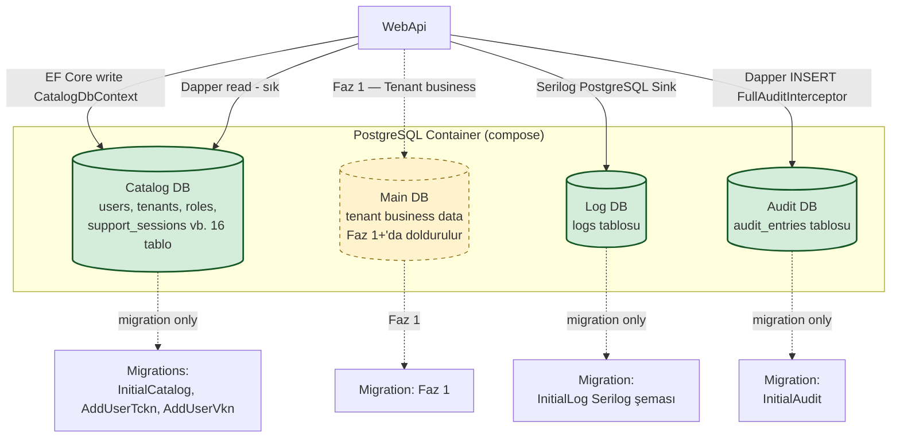
```mermaid
graph TD
    classDef live fill:#d4edda,stroke:#155724,stroke-width:2px
    classDef placeholder fill:#fff3cd,stroke:#856404,stroke-width:1px,stroke-dasharray: 5 5

    API[WebApi]

    subgraph "PostgreSQL Container (compose)"
        Cat[(Catalog DB<br/>users, tenants, roles,<br/>support_sessions vb. 16 tablo)]:::live
        Main[(Main DB<br/>tenant business data<br/>Faz 1+'da doldurulur)]:::placeholder
        Log[(Log DB<br/>logs tablosu)]:::live
        Aud[(Audit DB<br/>audit_entries tablosu)]:::live
    end

    API -->|EF Core write CatalogDbContext| Cat
    API -->|Dapper read - sık| Cat
    API -.->|Faz 1 — Tenant business| Main

    API -->|Serilog PostgreSQL Sink| Log
    API -->|Dapper INSERT FullAuditInterceptor| Aud

    Cat -.->|migration only| CatM[Migrations:<br/>InitialCatalog, AddUserTckn, AddUserVkn]
    Aud -.->|migration only| AudM[Migration:<br/>InitialAudit]
    Log -.->|migration only| LogM[Migration:<br/>InitialLog Serilog şeması]
    Main -.->|Faz 1| MainM[Migration: Faz 1]
```

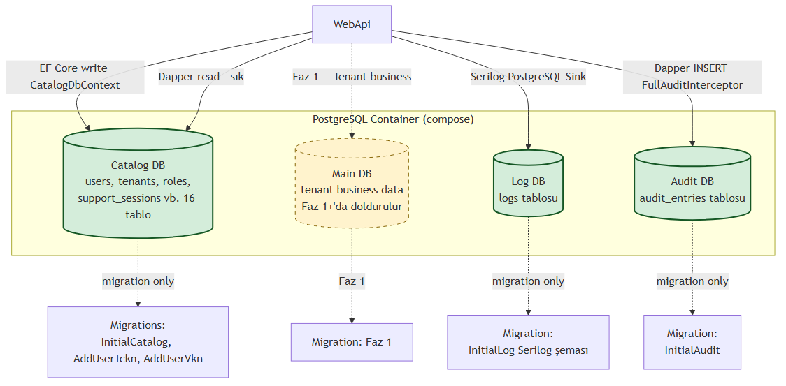

**Yazım/okuma kuralları:**

| DB | Yazım | Okuma | Notlar |
|---|---|---|---|
| **Catalog** | EF Core (CatalogDbContext) | EF Core + Dapper (sık okumalar) | Identity, tenant registry, sessions metadata |
| **Main** | (Faz 1) EF Core MainDbContext | (Faz 1) EF + Dapper | Hibrit multi-tenancy: shared mode default, dedicated `TenantConnection.IsActive=true` ile |
| **Log** | **Serilog Sink** (uygulama doğrudan yazmaz) | Manuel / Seq / Log viewer (Faz 1+) | Schema sadece migration için |
| **Audit** | **Dapper INSERT** (FullAuditInterceptor) | EF Core (Tenant Admin + System operatörü) | Append-only |

**MigrationRunner** — şu an Catalog odaklı; `--db <Catalog|Audit|Log|All>` argümanı Faz 1 başında genişletilecek.

---

## 15. Test Piramidi

146 test = 17 Application unit + 70 Domain unit + 25 Infrastructure integration + 34 WebApi integration.

| Katman | Test Dosyası | Test # | Fixture / Bağımlılık |
|---|---|---|---|
| **Domain Unit** | `SharedKernel/Common/Errors/ErrorTests` | 9 | Yok |
| | `SharedKernel/Common/Results/ResultTests` | 4 | Yok |
| | `SharedKernel/Common/Results/ResultOfTTests` | 8 | Yok |
| | `SharedKernel/Identifiers/Base58UrlCodeGeneratorTests` | 4 | Yok |
| | `SharedKernel/Time/SystemClockTests` | 2 | NSubstitute |
| | `SharedKernel/Localization/TurkishStringNormalizerTests` | 15 | Yok |
| | `SharedKernel/Auth/LoginIdentifierTests` | 28 | Theory ile |
| | **Toplam Domain** | **70** | |
| **Application Unit** | `Pipeline/AuthorizationBehaviorTests` | 3 | NSubstitute |
| | `Pipeline/ValidationBehaviorTests` | 4 | NSubstitute |
| | `Validators/LoginCommandValidatorTests` | 4 | Yok |
| | `Validators/EnterSupportModeCommandValidatorTests` | 5 | Yok |
| | (1 placeholder) | 1 | |
| | **Toplam Application** | **17** | |
| **Infrastructure Integration** | `Catalog/AuditingInterceptorTests` | 4 | Testcontainers PG 17 + DataProtection |
| | `Catalog/UrlCodeGeneratingInterceptorTests` | 3 | aynı |
| | `Catalog/ConcurrencyTests` | 1 | aynı |
| | `Catalog/UserRoleAssignmentScopeTests` | 4 | aynı |
| | `Catalog/SupportSessionReasonTests` | 2 | aynı |
| | `Catalog/TurkishSearchAlignmentTests` | 7 | aynı (citext + unaccent) |
| | **`Audit/FullAuditInterceptorTests`** | **4** | **+ Audit DB (aynı container, ikinci DB)** |
| | **Toplam Infrastructure** | **25** | |
| **WebApi Integration** | `Auth/LoginTests` | 5 | Testcontainers PG + Redis 8 + Identity seed (2FA enrolled) |
| | `Auth/RefreshTokenTests` | 4 | aynı |
| | `Auth/LogoutTests` | 3 | aynı |
| | `Auth/LogoutAllSessionsTests` | 2 | aynı |
| | `Auth/SwitchContextTests` | 3 | aynı |
| | `Support/SupportModeTests` | 7 | aynı + SeedTenant helper |
| | `TwoFactor/TwoFactorTests` | 10 | aynı + Email TOTP via UserManager |
| | **Toplam WebApi** | **34** | |
| | **GRAND TOTAL** | **146** | |

**Test stratejisi notları:**

- **Mocking minimum** — gerçek Postgres + gerçek Redis container'ları kullanılır. Bu Faz 0'ın 2.5 hafta CI build süresini doğrular ama production benzeri davranış sağlar.
- **NSubstitute** — Domain unit'lerinde `IClock` ve Application unit'lerinde `IValidator<T>`, `IPermissionChecker` mock'lanır.
- **FluentAssertions 6.12.2** pin'lendi — v8 ücretli (Cherry Picker Software).

---

## 16. Sürüm Geçmişi & Git Tag'leri

| Sürüm | Tarih | Kapsam | Git tag | Memory snapshot |
|---|---|---|---|---|
| v0.1.1 | 2026-05-17 | Solution + 16 proje + SDK pin | — | `v001` |
| v0.1.2 | 2026-05-17 | Docker compose + 4 ortam | — | `v002` |
| v0.1.3 | 2026-05-17 | SharedKernel | — | `v003` |
| v0.1.4.a | 2026-05-17 | Catalog şeması + EF Core | — | `v004` |
| v0.1.4.b | 2026-05-17 | Interceptor + Seed + IntegrationTest | — | `v005` |
| v0.1.5.a | 2026-05-17 | JWT + Redis session + login | — | `v005` (devam) |
| v0.1.5.a.1 | 2026-05-17 | Email/TCKN/Telefon login + Program.cs cleanup | — | `v005` |
| v0.1.5.a.2 | 2026-05-17 | VKN/YKN + MudBlazor karar | — | `v006` |
| v0.1.5.b.1 | 2026-05-17 | Multi-scope + switch + force-logout | — | `v007` |
| **v0.1.5.b.2** | 2026-05-17 | Support Mode (Enter/Exit/Elevate/Impersonate) | **`v0.1.5.b.2`** `df9a7bd` | `v008` |
| **v0.1.5.c** | 2026-05-17 | 2FA İskeleti | **`v0.1.5.c`** `0d1dde3` | `v009` |
| **v0.1.6** | 2026-05-17 | MediatR + FluentValidation + PermissionChecker | **`v0.1.6`** `8a78230` | `v010` |
| **v0.1.7** | 2026-05-17 | Audit Interceptor + Serilog + detaylı bağlam | **`v0.1.7`** `4ae0d22` | `v011` |

**Remote:** [github.com/YusufGulmezAi/Clean_Tenant](https://github.com/YusufGulmezAi/Clean_Tenant)

**CHANGELOG:** [docs/phases/v0.1/CHANGELOG.md](CHANGELOG.md)

---

## 17. Açık Konular & Teknik Borç

### Faz 1 (Zorunlu)

| # | Konu | Açıklama |
|---|---|---|
| 1 | **ManagementApp UI** | Blazor Server shell + auth + ekranlar |
| 2 | **Main DbContext** | Tenant business data DB'si — Faz 0'da boş |
| 3 | **Tenant onboarding wizard** | Tenant yarat → ilk admin → 2FA enrollment zorunlu |
| 4 | **Rol-Permission map** | 45 permission + 13 built-in rol arasında eşleşme |
| 5 | **`[RequirePermission]` yerleştirme** | Altyapı hazır, handler'lara konmadı |
| 6 | **PortalApp UI** | Unit kullanıcı ekranları |
| 7 | **Audit Explorer** | Tenant Admin ve System Operator için |

### Faz 1+ (Planlı)

| # | Konu | Hedef Faz |
|---|---|---|
| 1 | **GeoIP enrichment** (Country/City) | Faz 1.2-3 |
| 2 | **Audit DB outbox pattern** + retry | Faz 1.9 (Hangfire ile) |
| 3 | **Log DB retention/partitioning** | Faz 1+ |
| 4 | **MigrationRunner `--db` argümanı** | Faz 1.0 (Catalog/Audit/Log) |
| 5 | **SMTP/SMS gerçek implementasyon** | Faz 1.2 |
| 6 | **DataProtection ile `TenantConnection.ConnectionStringEncrypted`** | Faz 1.5 |
| 7 | **MAUI workload stable kaynak** | Faz 1.0 |
| 8 | **OpenAPI/Swagger gating prod'da** | Faz 1.3 |
| 9 | **Rate limiting** (`Microsoft.AspNetCore.RateLimiting`) | Faz 1.4 |
| 10 | **Idempotency-Key** middleware | Faz 1.4 |

### Belirsiz / Değerlendirilecek

- **Bot/spider audit gürültüsü** — şu an her HTTP isteği için audit yazılıyor; bot trafiği audit DB'yi şişirebilir.
- **Very-large entity JSON delta truncation** — büyük property'lerde changes_json çok büyük; max-size limit gerekebilir.
- **DataProtection key store** — Production'da Redis veya Blob? Şu an local file system.
- **Refresh token session lookup O(N)** — kullanıcı session sayısı büyürse refresh token kaydına `SessionId` FK eklemek.

---

## 18. Faz 1 — Detaylı Brifing

Memory'deki "Eğitici Mod" kuralına göre tam brifing formatında.

### 18.1 NE yapılacak (Faz 1 kapsamı)

1. **ManagementApp shell** — Blazor Server + MudBlazor:
   - Login sayfası (email/TCKN/Telefon/VKN tek input + persona seçici)
   - 2FA challenge ekranı (TOTP/Email/SMS/Recovery seçici + kod input)
   - Recovery code ekranı (enrollment sonrası one-time görüntü)
   - Persona/scope seçici (`availableScopes` listesi)
   - Auth state provider + JWT cookie/localStorage stratejisi
   - Layout shell (drawer + app bar + multi-tab context indicator)

2. **Tenant onboarding wizard** — adımlar:
   - Tenant adı + LegalName + BillingTier
   - HasDedicatedDatabase? → eğer evet, dedicated DB hazırlanır (Faz 1+'a ertelenebilir)
   - İlk Tenant Admin kullanıcı yarat (email/şifre/FirstName/LastName)
   - 2FA enrollment **zorunlu** (TOTP kurulum sayfası)
   - Onay ekranı + tenant URL'i

3. **Rol-Permission yönetim ekranı**:
   - 7 built-in System rolü permission map'i (matris: rol satır × permission sütun checkbox)
   - Custom rol yaratma (Tenant/Company/Unit scope'lu)
   - `[RequirePermission(...)]` attribute'larının handler'lara yerleştirilmesi (45+ handler için)

4. **Main DbContext + ilk tenant tablosu**:
   - Faz 0'da yalnız Catalog; Faz 1 multi-tenancy işletmesi için Main DB başlar
   - Shared mode default (TenantId kolonu ile)
   - İlk tablo örneği: `Companies` (Faz 1'in iş ekseni)

5. **Audit Explorer ekranı**:
   - Tenant Admin görünümü: kendi tenant'ı için filtre (date range, user, entity, action)
   - System Operator görünümü: cross-tenant filtre
   - Detay drill-down: bir audit entry → tüm metadata + changes_json'u render et
   - Export CSV/Excel (compliance için)

6. **Log Viewer ekranı (opsiyonel)**:
   - `logs` tablosunda filtre + canlı stream
   - Alternatif: Seq UI yeterli olabilir (compose'da zaten var)

7. **MediatR'ı ManagementApp'e tanıtma**:
   - Blazor Server tarafında `IMediator.Send` yerine WebApi'ye HTTP çağrısı (default)
   - Veya direkt `IMediator` enjekte etmek (in-process)

### 18.2 NEDEN

- Faz 0 backend tamam — production'a açılabilir ama **UI olmadan tenant onboarding manuel CLI**. Müşteri kabulü için UI şart.
- **Permission map'i Faz 1'in ManagementApp ekranıyla yapılması gerek** — Faz 0'da seed sadece permission kodlarını ve rol adlarını yarattı, eşleme yok.
- Memory'deki `feedback_ui_tasarim_danisma` — UI kararları öncesi kullanıcıyla konuşulacak.

### 18.3 NEDEN ŞİMDİ

- v0.1.7 push'landı, baseline temiz.
- Backend stable, davranışlar 146 testle kilitli — UI geliştirme sırasında backend kontratları sabit.
- Faz 0 → Faz 1 geçişi doğal kırılma noktası.

### 18.4 Açık Tasarım Soruları (raporu okuduktan sonra ayrıca tartışılacak)

1. **Tema rengi + logo** — MudBlazor default mor mu, kurumsal palet (mavi/yeşil)?
2. **Auth state yönetimi** — JWT cookie (HttpOnly + SameSite=Strict) mı, Blazor Server in-memory mı? Cookie tarayıcı yenilemesinde state korur; in-memory SignalR koparsa state kayıp.
3. **Layout shell** — Sol drawer + üst app bar mı, üst tabs + breadcrumb mı? Multi-context (sekme başına bağlam) UI'da nasıl gösterilecek?
4. **Tenant onboarding wizard sayfa adımları** — kaç adım, hangi sırada?
5. **Rol-Permission ekranı UX** — matris (rol satır × permission sütun checkbox) mı, rol detay sayfasında permission listesi mi?
6. **Audit explorer filtreleme** — temel filtreler (date range, user, action, entity type) ve gelişmiş filtreler (request path, IP range) Faz 1'in hangi alt-fazında?
7. **Memory snapshot v012 ne zaman?** — Faz 1 başlangıcında bir snapshot alınır mı, yoksa Faz 1.1 sonunda mı?
8. **Faz 1'in alt-faz numaralandırması** — Faz 0 v0.1.x kullandı; Faz 1 v0.2.x mi v1.0.x mi?

### 18.5 Faz 1 Alt-Faz Önerisi (taslak)

| Alt-faz | Kapsam | Tahmini iş yükü |
|---|---|---|
| **v0.2.1** | ManagementApp shell (boş app + MudBlazor + tema + layout) | ~3-5 dosya |
| **v0.2.2** | Auth ekranları (login + 2FA challenge + switch-context) | ~10-15 sayfa |
| **v0.2.3** | Main DbContext + ilk Companies tablosu + migration | ~5-8 dosya |
| **v0.2.4** | Tenant onboarding wizard | ~5-8 sayfa |
| **v0.2.5** | Rol-Permission yönetim ekranı + `[RequirePermission]` yerleştirme | ~5-8 sayfa + 30+ handler güncelleme |
| **v0.2.6** | Audit explorer + Log viewer | ~3-5 sayfa |
| **v0.2.7** | PortalApp aynı shell + Unit kullanıcı ekranları | ~5-8 sayfa |

Bu alt-faz sıralaması rapor yazıldıktan sonra kullanıcıyla netleştirilir.

---

## Appendix A: Build & Test Doğrulama Çıktıları

Faz 0 final commit (`4ae0d22`) üzerinde gerçek doğrulama çıktıları aşağıda.

**Build:**

```
$ dotnet build CleanTenant.slnx --nologo
...
Oluşturma başarılı oldu.
    0 Uyarı
    0 Hata
Geçen Süre 00:00:24.56
```

**Test (özet):**

```
$ dotnet test CleanTenant.slnx --nologo --no-build

Başarılı!  - Başarısız:     0, Başarılı:    17, Atlanan:     0, Toplam:    17 — CleanTenant.Application.UnitTests.dll
Başarılı!  - Başarısız:     0, Başarılı:    70, Atlanan:     0, Toplam:    70 — CleanTenant.Domain.UnitTests.dll
Başarılı!  - Başarısız:     0, Başarılı:    25, Atlanan:     0, Toplam:    25 — CleanTenant.Infrastructure.IntegrationTests.dll
Başarılı!  - Başarısız:     0, Başarılı:    34, Atlanan:     0, Toplam:    34 — CleanTenant.WebApi.IntegrationTests.dll

GRAND TOTAL: 146 / 146 yeşil
```

**Git log (Faz 0 commit zinciri):**

```
$ git log --oneline -5
4ae0d22 feat(audit): v0.1.7 — Audit interceptor + Serilog + detaylı bağlam (Faz 0 final)
8a78230 feat(pipeline): v0.1.6 — MediatR + FluentValidation + Permission Checker
0d1dde3 feat(2fa): v0.1.5.c — 2FA iskeleti (TOTP + Email + SMS + Recovery)
df9a7bd feat: Faz 0 v0.1.5.b.2 baseline
```

**Git tag listesi:**

```
$ git tag -l
v0.1.5.b.2
v0.1.5.c
v0.1.6
v0.1.7
```

---

## Kapanış

🎉 **Faz 0 tamamlandı.** Bu doküman Faz 0'ın yazılı kapanış belgesidir — Faz 1 başlarken referans olarak kullanılır.

**Faz 1'e geçmek için:** Bu raporun bölüm 18'inde sıralanan açık tasarım sorularını birlikte tartışıp v0.2.1 brifingini hazırlayalım.

---

*Bu doküman v0.1.7 commit `4ae0d22` üzerinde üretildi. Mermaid diyagramları [architecture-diagrams/](architecture-diagrams/) altında ayrı `.mmd` ve `.png` dosyaları olarak da mevcut.*
