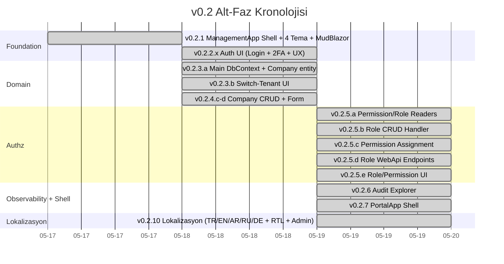
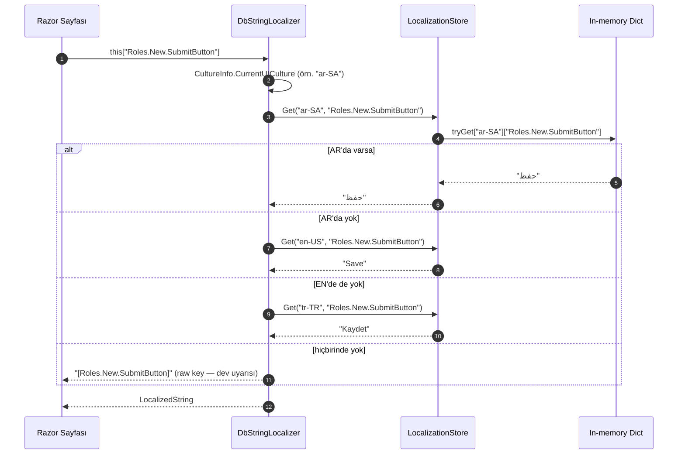
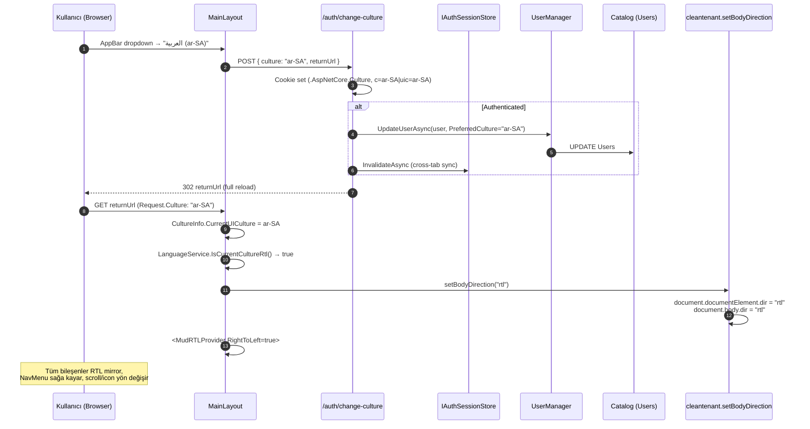
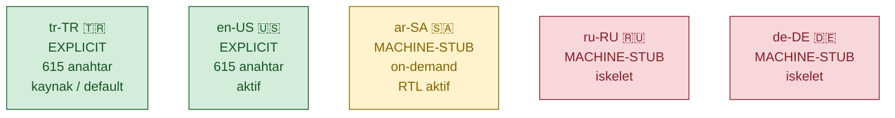

# v0.2.10 Lokalizasyon — Mimari Harita (Kompakt)

**Versiyon:** v0.2.10 (Faz 1 lokalizasyon kapanış — tag `v0.2.10`)
**Tarih:** 2026-05-19
**Kapsam:** DB-tabanlı 5 dilli (TR/EN/AR/RU/DE) lokalizasyon altyapısı + RTL + admin yönetim sayfası. **Faz 1** içinde dar bir alt-faz kapanış raporudur; tam mimari üst-bakış için [../v0.1/v0.1-FINAL-ARCHITECTURE-MAP.md](../v0.1/v0.1-FINAL-ARCHITECTURE-MAP.md) referans alınmalıdır.

Bu doküman, [CHANGELOG.md](CHANGELOG.md) ile birlikte okunur. CHANGELOG kronolojik / detaylı, bu rapor üst-bakış / görsel / topluca.

---

## İçindekiler

- [0. Yönetici Özeti](#0-yönetici-özeti)
- [1. v0.2 Faz Tarihçesi](#1-v02-faz-tarihçesi)
- [2. Lokalizasyon Entity & Store Mimarisi](#2-lokalizasyon-entity--store-mimarisi)
- [3. Loc Lookup — Request Flow](#3-loc-lookup--request-flow)
- [4. Admin Update + Cache Reload Akışı (v0.2.10.g)](#4-admin-update--cache-reload-akışı-v0210g)
- [5. Culture Switch & RTL Akışı](#5-culture-switch--rtl-akışı)
- [6. 5 Culture Matrix & Anahtar İstatistiği](#6-5-culture-matrix--anahtar-istatistiği)
- [7. v0.2.10.g — Slice Bileşenleri](#7-v0210g--slice-bileşenleri)
- [8. Açık Konular & v0.3 Brifing](#8-açık-konular--v03-brifing)

---

## 0. Yönetici Özeti

v0.2.10 ile CleanTenant Presentation katmanı tamamen lokalize edildi:

| Alt-faz | Çıktı |
|---|---|
| a–c | `LocalizedResource` entity + EF migration + `LocalizationStore` (singleton) + `DbStringLocalizer` + `LocalizationCatalog` (~480 → 642 anahtar) |
| d | AppBar dropdown + `/auth/change-culture` + `User.PreferredCulture` persist |
| e | Tüm UI: Layout (NavMenu/MainLayout/DataTable), Form bileşenleri, SystemArea (12) + TenantArea (8) + Auth/Home/About/Settings/NotFound (10 sayfa) |
| f | RTL (Arabic): `MudRTLProvider` + `<body dir="rtl">` JS interop (ManagementApp + PortalApp) |
| **g** | **`/system/localization` admin sayfası** + `System.Localization.Manage` permission + `SystemAdmin` baseline seed + Application slice + WebApi endpoint + `ILocalizationCacheRefresher` |

**Sayısal özet:**
- 642 lokalizasyon anahtarı (TR + EN explicit; AR/RU/DE machine-stub)
- 1 230 satır seed (615 key × 2 culture; AR/RU/DE on-demand culture switch'iyle eklenir)
- 5 culture (TR default, AR RTL, RU/DE/EN passive)
- 1 yeni endpoint dosyası (`SystemLocalizationEndpoints`) + 2 route
- 1 yeni admin sayfası (`/system/localization`)
- 1 yeni Application slice (`Features/System/Localization/` — 7 dosya) + 1 abstraction (`ILocalizationCacheRefresher`)
- 1 yeni Infrastructure adapter (`LocalizationCacheRefresher`)

**Faz 0 → 1 sınırı (referans):** v0.1.7'de Faz 0 backend tamamdı. v0.2 Faz 1'i UI olarak açtı; v0.2.10 lokalizasyonu kapadı. Faz 1 hâlâ devam ediyor — Units/Residents/Invoices/Logs/PermissionCatalog UI v0.3+'ta.

---

## 1. v0.2 Faz Tarihçesi



**Tag özeti** (v0.2 alt-fazlar):
- `v0.2.6` — Audit Explorer
- `v0.2.7` — PortalApp Shell + CompanyCreatePage TenantId fix
- `v0.2.10` — Lokalizasyon (final, admin sayfası dahil)

CHANGELOG'da görünen ama tag atılmamış alt-fazlar: v0.2.1, v0.2.2.x, v0.2.3.x, v0.2.4.x, v0.2.5.x (tek tag yerine birleşik commit'lerle ilerlemişler).

---

## 2. Lokalizasyon Entity & Store Mimarisi

`LocalizedResource` entity tek doğruluk kaynağı (Catalog DB); `LocalizationStore` singleton in-memory cache; `DbStringLocalizer` ASP.NET Core'un `IStringLocalizer` kontratını sağlayan adapter.

```mermaid
graph LR
    classDef domain fill:#cfe2ff,stroke:#084298,color:#084298
    classDef infra fill:#d4edda,stroke:#155724,color:#155724
    classDef ms fill:#fff3cd,stroke:#856404,color:#856404
    classDef ui fill:#e2d4ff,stroke:#5a32a3,color:#5a32a3

    subgraph Domain
        LR_ENTITY["LocalizedResource<br/>(Key, Culture, Value,<br/>IsMachineTranslated)"]:::domain
    end

    subgraph "Infrastructure.Persistence (Catalog DB)"
        CTX["CatalogDbContext<br/>DbSet&lt;LocalizedResource&gt;"]:::infra
        SEEDER["LocalizationSeeder<br/>(startup, idempotent)"]:::infra
        STORE["LocalizationStore<br/>(Singleton)<br/>Dictionary&lt;culture, Dict&lt;key, value&gt;&gt;"]:::infra
        DBLOC["DbStringLocalizer<br/>(IStringLocalizer impl, Scoped)"]:::infra
    end

    subgraph "Microsoft.Extensions.Localization"
        ISL["IStringLocalizer"]:::ms
    end

    subgraph "Presentation (Razor)"
        RAZOR["@inject IStringLocalizer Loc<br/>@Loc[\"Key\"]"]:::ui
    end

    LR_ENTITY -.->|EF Core mapping| CTX
    CTX -->|ReloadAsync| STORE
    SEEDER -->|missing key insert| CTX
    DBLOC -->|Get(culture, key)| STORE
    DBLOC -.implements.-> ISL
    RAZOR -->|DI| DBLOC
```

**Önemli kararlar:**
- **In-memory snapshot**: `Dictionary<culture, Dictionary<key, value>>` — `Get` çağrısı O(1).
- **Atomik reload**: `LocalizationStore.ReloadAsync` lock altında tüm sözlüğü yeni instance ile değiştirir; mevcut okumalar eski snapshot üzerinde devam eder, kesinti yok.
- **Composite unique**: `(Key, Culture)` index — duplicate ekleme DB seviyesinde engellenir.
- **Soft delete**: `BaseEntity.IsDeleted` filtresi `ReloadAsync` ve query'lerde uygulanır.

---

## 3. Loc Lookup — Request Flow

Bir Razor sayfası `@Loc["Roles.New.SubmitButton"]` çağırdığında ne olur?



**Fallback zinciri:** `CurrentUICulture` → `en-US` → `tr-TR` → `[Key]` raw. Eksik çeviri runtime'da `[Key]` formatında görünür; geliştirici hızlıca yakalar.

---

## 4. Admin Update + Cache Reload Akışı (v0.2.10.g)

`/system/localization` sayfasından bir anahtar düzenlenirken yapılan tam akış:

```mermaid
sequenceDiagram
    autonumber
    participant UI as LocalizationManagePage (Razor)
    participant Med as IMediator
    participant Auth as AuthorizationBehavior<br/>(MediatR pipeline)
    participant H as UpdateLocalizationEntryCommandHandler
    participant CTX as CatalogDbContext
    participant DB as PostgreSQL (Catalog)
    participant CR as ILocalizationCacheRefresher
    participant STORE as LocalizationStore

    UI->>Med: Send(UpdateLocalizationEntryCommand(Key, Culture, NewValue))
    Med->>Auth: pipeline
    Auth->>Auth: RequirePermission("System.Localization.Manage") check
    alt Yetkisiz
        Auth-->>UI: Result.Failure(AUTH-FORBIDDEN, 403)
    else Yetkili
        Auth->>H: Handle(command, ct)
        H->>CTX: FirstOrDefault(Key==... && Culture==... && !IsDeleted)
        CTX->>DB: SELECT
        DB-->>CTX: LocalizedResource (tracked)
        H->>H: entry.Value = NewValue; entry.IsMachineTranslated = false
        H->>CTX: SaveChangesAsync
        CTX->>DB: UPDATE (+ Audit Interceptor)
        H->>CR: RefreshAsync
        CR->>STORE: ReloadAsync
        STORE->>DB: SELECT * (AsNoTracking)
        DB-->>STORE: 615 key × 2 culture (~1230 satır)
        STORE->>STORE: lock { _translations = newDict }
        STORE-->>CR: ok
        H-->>UI: Result.Success
        UI->>UI: Snackbar.Success + tablo refresh
    end
```

**Önemli noktalar:**
- **Audit otomatik**: `FullAuditInterceptor` `LocalizedResource` mutasyonunu yakalar — Audit Explorer'da görünür.
- **Tam reload**: Sadece etkilenen anahtar değil, tüm cache yeniden yüklenir — küçük katalog (~1.2K satır) için bu basitlik karmaşıklığa değer.
- **Tek-makine yansıma**: Reload sadece bu instance'ı günceller. Çok instance senaryosu için Redis pub-sub invalidation kanalı v0.3+'ta düşünülecek (mevcut `CacheInvalidationSubscriber` pattern'i örnek).
- **MachineTranslated auto-clear**: Admin manuel düzeltme yaptığı için `IsMachineTranslated = false` otomatik set edilir.

---

## 5. Culture Switch & RTL Akışı

Kullanıcı AppBar'daki dil dropdown'ından AR seçtiğinde:



**RTL kararları:**
- **Çift mekanizma**: `MudRTLProvider` MudBlazor bileşenlerini mirror'lar; `<body dir="rtl">` custom CSS / 3rd-party widget'lar için DOM-level RTL sağlar.
- **PortalApp inline**: `LanguageService` referansı olmadığı için `App.razor`'da inline JS + `CurrentUICulture.StartsWith("ar")` kontrol.
- **MobilApp kapsam dışı**: MAUI Blazor `Window.FlowDirection` ayrı bir strateji; v0.3+ değerlendirilecek.
- **Idempotent**: `setBodyDirection` her render'da çağrılabilir — cookie-driven culture change tam reload tetiklediği için sorun olmaz.

---

## 6. 5 Culture Matrix & Anahtar İstatistiği



**Machine-stub formatı:** Catalog'da explicit EN olmayan anahtarlar için `"[EN] {tr}"`. AR/RU/DE için sabit `"[<CULTURE>] {tr}"` placeholder (LocalizationSeeder eklendiğinde). Admin sayfasında **MachineYes** chip ile işaretli, düzenleyince auto-clear.

**Anahtar dağılımı (615 key):**

| Modül | Anahtar |
|---|---|
| Permission Module / Description | 60 |
| Common UI (Save/Cancel/Confirm/...) | 24 |
| Navigation Menu | 28 |
| Layout (AppBar/Footer/Error) | 14 |
| DataTable | 8 |
| Login + 2FA | 40+ |
| Tenants/Companies/Roles CRUD + Form | 90+ |
| BuildingSchema | 60+ |
| Audit/Banks/LookUp | 50+ |
| Settings + Home + About + NotFound | 20+ |
| Page Title'ları | 12 |
| Error format + tooltip | 15 |
| **LocalizationManage.\*** (v0.2.10.g) | **27** |
| ... (diğer) | ~167 |

---

## 7. v0.2.10.g — Slice Bileşenleri

Admin sayfasının tüm bileşenleri (Clean Architecture katmanları):

```mermaid
graph TB
    classDef ui fill:#e2d4ff,stroke:#5a32a3,color:#5a32a3
    classDef api fill:#cfe2ff,stroke:#084298,color:#084298
    classDef app fill:#fff3cd,stroke:#856404,color:#856404
    classDef infra fill:#d4edda,stroke:#155724,color:#155724
    classDef domain fill:#f8d7da,stroke:#842029,color:#842029

    subgraph "Presentation.ManagementApp"
        PAGE["LocalizationManagePage.razor<br/>/system/localization"]:::ui
        NAV["NavMenu.razor<br/>(Sistem Yönetimi → Localization)"]:::ui
    end

    subgraph "Presentation.WebApi"
        EP["SystemLocalizationEndpoints<br/>GET + PUT /api/v1/system/localization/entries"]:::api
    end

    subgraph "Application"
        Q["GetLocalizationEntriesQuery<br/>+ Handler + Validator"]:::app
        C["UpdateLocalizationEntryCommand<br/>+ Handler + Validator"]:::app
        DTO["LocalizationEntryListItem<br/>LocalizationEntryFilter<br/>LocalizationPageResult"]:::app
        ICACHE["ILocalizationCacheRefresher"]:::app
        ICTX["ICatalogDbContext<br/>(DbSet&lt;LocalizedResource&gt;)"]:::app
        PERM["[RequirePermission<br/>(System.Localization.Manage)]"]:::app
    end

    subgraph "Infrastructure.Persistence"
        CR["LocalizationCacheRefresher<br/>→ LocalizationStore.ReloadAsync"]:::infra
        SEED["CatalogSeeder<br/>SeedSystemAdminPermissionsAsync"]:::infra
        CAT["PermissionCatalog<br/>System.Localization.Manage"]:::infra
        LCAT["LocalizationCatalog<br/>27 LocalizationManage.* anahtar"]:::infra
    end

    subgraph "Domain"
        LR["LocalizedResource"]:::domain
    end

    PAGE -->|@inject IMediator| Q
    PAGE -->|@inject IMediator| C
    NAV -.->|@page route| PAGE
    EP -->|IMediator.Send| Q
    EP -->|IMediator.Send| C
    Q -->|reads| ICTX
    C -->|writes| ICTX
    C -->|RefreshAsync| ICACHE
    Q -.->|attribute| PERM
    C -.->|attribute| PERM
    ICACHE -.implemented by.-> CR
    ICTX -.implemented by.-> CAT
    SEED -->|baseline insert| CAT
    LCAT -.feeds.-> LR
```

**Dosya envanteri (Adım 9 commit kapsamı):**

| Katman | Dosya | Tip |
|---|---|---|
| Domain | (yok — `LocalizedResource` zaten v0.2.10.a'da) | — |
| Application | `Common/Localization/ILocalizationCacheRefresher.cs` | yeni |
| Application | `Common/Persistence/ICatalogDbContext.cs` | güncellendi (`LocalizedResources` DbSet) |
| Application | `Features/System/Localization/LocalizationEntryListItem.cs` | yeni |
| Application | `Features/System/Localization/LocalizationEntryFilter.cs` | yeni |
| Application | `Features/System/Localization/LocalizationPageResult.cs` | yeni |
| Application | `Features/System/Localization/GetLocalizationEntriesQuery.cs` | yeni |
| Application | `Features/System/Localization/GetLocalizationEntriesQueryHandler.cs` | yeni |
| Application | `Features/System/Localization/UpdateLocalizationEntryCommand.cs` | yeni |
| Application | `Features/System/Localization/UpdateLocalizationEntryCommandHandler.cs` | yeni |
| Application | `Features/System/Localization/UpdateLocalizationEntryCommandValidator.cs` | yeni |
| Infrastructure.Persistence | `Localization/LocalizationCacheRefresher.cs` | yeni |
| Infrastructure.Persistence | `DependencyInjection.cs` | güncellendi (`ILocalizationCacheRefresher` register) |
| Infrastructure.Persistence | `Seeding/CatalogSeeder.cs` | güncellendi (`SeedSystemAdminPermissionsAsync`) |
| Infrastructure.Persistence | `Seeding/LocalizationCatalog.cs` | güncellendi (27 yeni anahtar) |
| Presentation.WebApi | `Endpoints/SystemLocalizationEndpoints.cs` | yeni |
| Presentation.WebApi | `Endpoints/EndpointMappingExtensions.cs` | güncellendi (`MapSystemLocalizationEndpoints`) |
| Presentation.ManagementApp | `Components/Pages/SystemArea/LocalizationManagePage.razor` | yeni |
| Presentation.ManagementApp | `Components/Layout/NavMenu.razor` | güncellendi (Localization link aktif) |

Toplam: **13 yeni dosya** + **6 güncellenmiş dosya**.

---

## 8. Açık Konular & v0.3 Brifing

**v0.2.10 sonrası açık konular:**

| # | Konu | Aciliyet |
|---|---|---|
| 1 | AR/RU/DE explicit çeviri kalitesi (machine-stub'lar) | Düşük — operatör admin sayfasından elle revize edebilir |
| 2 | Multi-instance cache invalidation (Redis pub-sub) | Düşük — şu an tek instance senaryosu |
| 3 | Pluralization (cüce/çoğul form'lar) | Düşük — gerektiğinde anahtar adlandırmasıyla yönetiliyor (örn. `.Singular` / `.Plural`) |
| 4 | LocalizationStore'un büyüme limiti | Düşük — 615 key × 5 culture × ~50 byte ≈ 150 KB; rahat |
| 5 | Audit Explorer'da `LocalizedResource` ChangesJson'ı çok uzun olabilir (40+ alanlı entity için değil ama Value 4000 char olabilir) | İzleme |
| 6 | i18n key drift (kullanılmayan key'ler kataloğu şişirir) | İzleme — periyodik temizlik scripti gerekebilir |
| 7 | MobilApp lokalizasyonu (kapsam dışı) | v0.3+ planı |

**v0.3 brifing — Unit / Resident:**

v0.3 ile **Faz 1 alt-faz 1.6** alanı açılır. Plan dosyası hâlâ yazılmadı; kapsam:

- **Domain**: `Unit`, `Resident`, `UnitResident` entity'leri (Main DB)
- **Application**: Unit/Resident CRUD handler'ları (CreateUnit, GetUnitsByCompany, AssignResident, ...)
- **WebApi**: `UnitEndpoints`, `ResidentEndpoints`
- **ManagementApp**: `CompanyArea/Units` listesi + Resident yönetimi (NavMenu'de hâlâ `Faz 1.6` chip'li)
- **PortalApp**: Sakin self-servis (kendi birim bilgisi)

v0.3 başlangıcında bu mimari haritanın bir muadili `docs/phases/v0.3/v0.3-FINAL-ARCHITECTURE-MAP.md` olarak yazılır (kural: faz sonu mimari haritası kuralı).

**Yeni anahtarlar v0.3 için:** Unit/Resident UI'ı için LocalizationCatalog'a `Unit.*`, `Resident.*`, `UnitResident.*` blokları eklenir; admin sayfası bunları otomatik gösterir (sadece DB'ye seed edildikleri an).

---

## Kapanış

v0.2.10 ile CleanTenant 5 dilde tam lokalize bir UI'a sahip. Mimari karar (DB-backed `IStringLocalizer` + singleton in-memory store + cookie-driven culture change + RTL) gelecekte Türkçe-spesifik düzeltmeler (örn. İ/I dotted/dotless collation), Redis pub-sub multi-instance reload, ve pluralization gibi genişletmeler için temiz bir zemin bırakıyor.

Tag `v0.2.10` — Faz 1'in lokalizasyon kapanışı.
