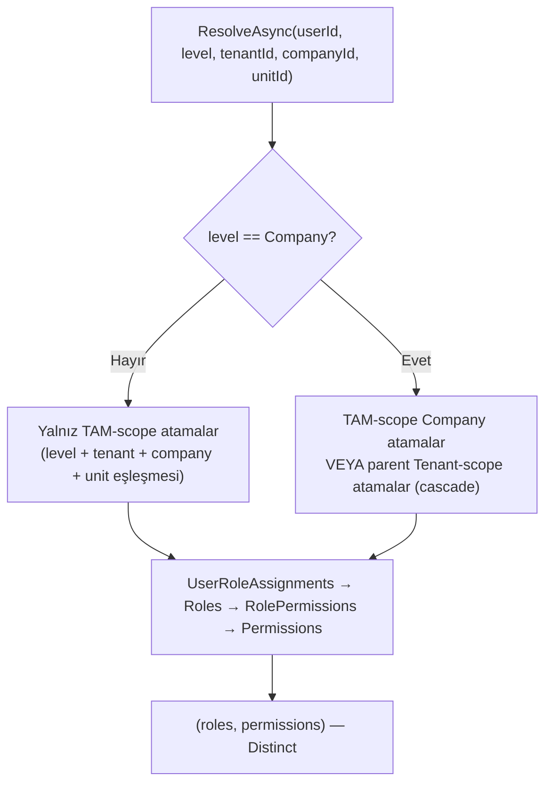
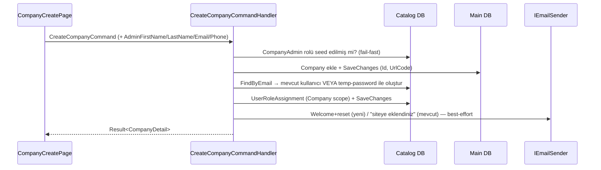

# v0.2.13.e Süper Yetkili Roller & Erişim — Mimari Harita

**Versiyon:** v0.2.13.e (commit öncesi — bu oturum kapanışı)
**Tarih:** 2026-05-23
**Kapsam:** Süper yetkili Tenant/Company rolleri (izin seed), her yeni Site'a zorunlu CompanyAdmin provisioning, Tenant→Site izin cascade'i, kullanıcı bazlı kalıcı tema (v0.2.13.d), Siteler liste tasarımının bağlamlar arası birleştirilmesi ve Context Switcher geçiş deneyimi.

Bu doküman [CHANGELOG.md](CHANGELOG.md) ile birlikte okunur. v0.2.13 umbrella fazının diğer parçaları (Yapı Şeması, Muhasebe, Bütçe, Tahakkuk) bu haritanın kapsamı dışındadır.

---

## İçindekiler

- [0. Yönetici Özeti](#0-yönetici-özeti)
- [1. Alt-faz Tarihçesi](#1-alt-faz-tarihçesi)
- [2. Etkilenen Bileşenler](#2-etkilenen-bileşenler)
- [3. Süper Rol & İzin Modeli](#3-süper-rol--izin-modeli)
- [4. İzin Cascade Mimarisi](#4-izin-cascade-mimarisi)
- [5. Company Admin Provisioning Akışı](#5-company-admin-provisioning-akışı)
- [6. Kullanıcı Bazlı Kalıcı Tema (v0.2.13.d)](#6-kullanıcı-bazlı-kalıcı-tema-v0213d)
- [7. UI: Siteler Birleştirme + Context Switcher](#7-ui-siteler-birleştirme--context-switcher)
- [8. Test Kapsamı](#8-test-kapsamı)
- [9. Mimari Kararlar](#9-mimari-kararlar)
- [10. Açık Konular & Sonraki Adımlar](#10-açık-konular--sonraki-adımlar)

---

## 0. Yönetici Özeti

Bu alt-faz, her bağlamın net bir "tam yetkili" sahibi olmasını sağlar ve bunu mevcut Support Mode v2 denetim mimarisini bozmadan yapar.

| Alan | Çıktı |
|---|---|
| **Süper roller** | Built-in `TenantAdmin` → tüm Tenant + Company izinleri; `CompanyAdmin` → tüm Company izinleri (idempotent seed). Yeni rol icat edilmedi. |
| **Company provisioning** | Her yeni Site açılışında zorunlu CompanyAdmin kullanıcı (gerçek kişi; site formunda yönetici ad/e-posta). |
| **Cascade** | Tenant süper kullanıcısı, tenant'ın **tüm sitelerinde** tam yetkili (aşağı yönlü; yukarı sızma yok). |
| **Ortak resolver** | `IScopePermissionResolver` — izin çözümleme + cascade kuralı tek yerde. |
| **Tema (v0.2.13.d)** | Renk teması + gece modu kullanıcı bazında DB'de kalıcı; her login'de uygulanır; default "Kurumsal Mavi". |
| **UI** | Siteler listesi her bağlamda tek `CompaniesListView`; Context Switcher geçişinde overlay + dashboard yönlenmesi. |
| **Korunan** | System operatör geçişi (Support Mode v2: System scope + SupportSession + `AllowSystemWriteAccess`) **değiştirilmedi**. |

**Sayısal özet:**
- 94 permission (45 Tenant / 33 Company / 16 System / **0 Unit**)
- TenantAdmin seed = 78 izin (Tenant + Company) · CompanyAdmin seed = 33 izin (Company)
- 21 yeni test (11 unit + 5 bUnit + 5 integration), tümü yeşil
- Şema değişikliği yok (yalnız v0.2.13.d tema migration'ı: `AddUserThemePreferences`)

---

## 1. Alt-faz Tarihçesi

> Commit öncesi durum; bu harita kapanış commit'iyle birlikte işlenir.

| Parça | Özet |
|---|---|
| **v0.2.13.d** | Avatar menü sadeleştirme (2FA/Ayarlar kaldırıldı) + tema profil > Tema sekmesine taşındı + `UserThemeService` (DB kaynaklı) + `AddUserThemePreferences` migration. Siteler listesi `CompaniesListView` ile birleştirildi. Context Switcher overlay + dashboard yönlenmesi. |
| **v0.2.13.e** | `TenantAdmin`/`CompanyAdmin` izin seed'i + `CreateCompanyCommand` CompanyAdmin provisioning + `IScopePermissionResolver` cascade + `SwitchContext` guard genişletme + faz kapanış testleri. |

---

## 2. Etkilenen Bileşenler

```
Core
├── CleanTenant.Domain
│   └── Identity/Users/User.cs                          — PreferredThemePreset, PreferredDarkMode (v.d)
└── CleanTenant.Application
    ├── Common/Authorization/
    │   ├── IScopePermissionResolver.cs                 — YENİ (cascade sözleşmesi)
    │   └── ScopePermissionResolver.cs                  — YENİ (cascade impl)
    ├── Features/Main/Companies/
    │   ├── CreateCompanyCommand.cs                     — Admin* alanları + [RequirePermission]/[TenantWriteOperation]
    │   ├── CreateCompanyCommandHandler.cs              — CompanyAdmin provisioning (çapraz-DB)
    │   └── CreateCompanyCommandValidator.cs            — admin alan kuralları
    ├── Features/Profile/{GetTheme,SetTheme}/           — YENİ (tema query/command, v.d)
    └── Features/Auth/SwitchContext/
        └── SwitchContextCommandHandler.cs             — guard genişletme + resolver çağrısı

Infrastructure
└── CleanTenant.Infrastructure.Persistence
    ├── Seeding/CatalogSeeder.cs                        — SeedTenantAdminPermissionsAsync / SeedCompanyAdminPermissionsAsync
    ├── Seeding/LocalizationCatalog.cs                  — CompanyForm.Admin* + Validation.Company.Admin* + Profile.Theme.*
    ├── Catalog/Configurations/UserConfiguration.cs     — tema alan mapping (v.d)
    └── Catalog/Migrations/…AddUserThemePreferences     — YENİ migration (v.d)

Presentation
├── CleanTenant.ManagementApp
│   ├── Services/UserThemeService.cs                    — YENİ (IThemeService, DB kaynaklı, v.d)
│   ├── Components/Shared/CompaniesListView.razor       — YENİ (ortak Siteler liste görünümü)
│   ├── Components/Shared/CompanyForm*.{razor,cs}       — Create modunda "Site Yöneticisi" bölümü
│   ├── Components/Profile/ProfileThemePanel.razor      — YENİ (tema sekmesi paneli, v.d)
│   ├── Components/Pages/{SystemArea,TenantArea}/CompaniesListPage.razor — CompaniesListView'e indirgendi
│   ├── Components/Pages/{SystemArea,TenantArea}/CompanyCreatePage.razor — admin alanları geçirilir
│   ├── Components/Layout/MainLayout.razor              — avatar menü + palet ikonu /profile?tab=theme
│   └── wwwroot/{js/cleantenant.js, app.css}           — switch overlay
└── CleanTenant.WebApi
    └── Endpoints/CompanyEndpoints.cs                   — CreateCompanyRequest admin alanları
```

---

## 3. Süper Rol & İzin Modeli

İzin kataloğu (`PermissionCatalog`) her izne bir **`MinimumRoleScope`** (privilege ceiling) atar; filtre kuralı `role.Scope <= permission.MinimumRoleScope`.

| Scope | İzin sayısı | Süper rolde |
|---|---|---|
| System (1) | 16 | — (operatöre özel; `Tenant.Create`, `Support.*` …) |
| Tenant (2) | 45 | **TenantAdmin** |
| Company (3) | 33 | **TenantAdmin** (cascade) + **CompanyAdmin** |
| Unit (4) | 0 | — (sakin/portal rolleri; ileride) |

**Seed kuralı** ([CatalogSeeder.cs](../../../src/Infrastructure/CleanTenant.Infrastructure.Persistence/Seeding/CatalogSeeder.cs), idempotent, her startup):
- `TenantAdmin` ← `MinimumRoleScope ∈ {Tenant, Company}` (78 izin)
- `CompanyAdmin` ← `MinimumRoleScope == Company` (33 izin)
- System ve Unit izinleri kasıtlı **dışarıda** → privilege ceiling korunur.

> Built-in `TenantAdmin`/`CompanyAdmin` zaten vardı ama izinleri boştu; sadece doldurduk. Yeni "Süper" rol türetilmedi.

---

## 4. İzin Cascade Mimarisi

İzin çözümleme dört noktada (Login + 3 switch handler) tekrarlanan bir join'di. Cascade kuralını tek yerde toplamak için ortak resolver eklendi; `SwitchContext` ona yönlendirildi.



**Önemli:** Tam-scope dalı her zaman ilk OR koşulu → Tenant ataması olmayan sıradan bir company kullanıcısı **bire bir eski sonucu** alır (yukarı sızma yok). Cascade yalnız Company hedefinde devreye girer.

**İki geçiş yolu:**
- **SwitchTenant** (Context Switcher'ın kullandığı `/auth/switch-tenant`): zaten "en geniş atama" (Tenant>Company>Unit) seçtiğinden, TenantAdmin'in company izinleri olunca cascade **otomatik** çalışır.
- **SwitchContext** (API): tam-scope filtreliyordu → guard genişletildi (Company hedefinde parent Tenant ataması da kabul) + resolver'a bağlandı.

> System operatör dalı ve SupportSession bloğu **dokunulmadı**; cascade yalnız alt-scope (tenant admin) kullanıcılar içindir.

---

## 5. Company Admin Provisioning Akışı

Çapraz-DB: `Company` → Main DB, kullanıcı/rol/atama → Catalog DB. Tenant onboarding deseninin (`CreateTenantCommandHandler`) Company karşılığı.



**Yetki kapısı:** `CreateCompanyCommand` artık `[RequirePermission("Company.Create")]` + `[TenantWriteOperation]`. System bypass eder; TenantAdmin seed sonrası `Company.Create`'e sahiptir; ReadOnly Support modunda yazma reddedilir.

> Çapraz-DB → iki ayrı SaveChanges (dağıtık transaction yok; tenant akışıyla aynı profil). Provisioning sırası en kötü orphan'ı (admin'siz site) en aza indirir; admin'siz site zaten parent tenant admin tarafından cascade ile yönetilebilir.

---

## 6. Kullanıcı Bazlı Kalıcı Tema (v0.2.13.d)

```
Avatar menüsü:  [Profil] [Çıkış]            (2FA Yönetimi / Ayarlar kaldırıldı)
Üst bar palet ikonu → /profile?tab=theme
/settings/theme → /profile?tab=theme (redirect)

Profil > Tema sekmesi → ProfileThemePanel (preset kartları + gece modu anahtarı)

IThemeService = UserThemeService (DB kaynaklı)
  InitializeAsync()        → GetUserThemeQuery (circuit init'te DB'den okur, uygular)
  SetPresetAsync / ToggleDarkModeAsync → anında UI + SetUserThemeCommand (DB persist)

User.PreferredThemePreset (string?) + PreferredDarkMode (bool)  → migration AddUserThemePreferences
```

**Login'de uygulama:** Login → tam reload → yeni circuit → `MainLayout.OnAfterRenderAsync` → `InitializeAsync` DB'den okur. AuthEndpoints'e dokunmaya gerek kalmadı. Default: `PreferredThemePreset == null` → "Kurumsal Mavi" + açık mod.

> `LocalStorageThemeService` üretimde kullanılmıyor ama kendi bUnit testi referans verdiği için korundu (kaldırma kullanıcı onayına bırakıldı).

---

## 7. UI: Siteler Birleştirme + Context Switcher

**Siteler birleştirme:** System ve Tenant alanlarındaki iki ayrı liste, tek [CompaniesListView.razor](../../../src/Presentation/CleanTenant.ManagementApp/Components/Shared/CompaniesListView.razor) ile değiştirildi. Tasarım yapısal olarak tek kaynaktan gelir; bağlam farkları parametreyle: `ShowTenantColumn` (Sistemde açık), `ShowBuildingSchemaAction` (Tenant'a özel), `EditRoutePrefix`. Veri kısıtı (System: tüm siteler; Tenant: yalnız kendi tenant'ı) üst sayfada uygulanır.

**Context Switcher geçişi:** Tenant/company/System değişiminde JS overlay (`showSwitchOverlay`) ile body anında örtülür (eski bağlam görünmez) + spinner; geçiş bitince server her zaman **dashboard'a (`/`)** yönlendirir (`returnUrl` yalnız hata fallback'i). `app.css` overlay stili tema paletinden renk alır.

---

## 8. Test Kapsamı

| Proje | Yeni test | Kapsam |
|---|---|---|
| Application.UnitTests | 11 | `CreateCompanyCommandValidatorTests` — admin alan kuralları |
| ManagementApp.bUnitTests | 5 | `CompanyFormValidatorTests` — Create vs Edit modu admin zorunluluğu |
| Infrastructure.IntegrationTests | 5 | `SuperAdminRolesAndCascadeTests` — seed (TenantAdmin/CompanyAdmin), idempotency, cascade, sızma-yok |
| **Toplam (yeni)** | **21** | tümü yeşil |

Integration testleri gerçek Postgres (Testcontainers) üzerinde; `Infrastructure.IntegrationTests.csproj`'a `Application` proje referansı eklendi. WebApi integration suite'i (pre-existing kırık, memory) bilinçli olarak değiştirilmedi.

---

## 9. Mimari Kararlar

1. **Built-in rolleri doldur, yeni rol türetme.** `TenantAdmin`/`CompanyAdmin` zaten "tam yetki" niyetiyle vardı; rol çoğalmasından kaçınıldı.
2. **Cascade yalnız aşağı yönlü (Company'ye).** Tenant süper kullanıcısı tüm siteleri yönetir; company kullanıcısı tenant yetkisi almaz. Unit'e cascade yok (sakin/portal ayrımı korunur).
3. **Support Mode v2 korundu.** System operatör geçişi rol atamasıyla değiştirilmedi; SupportSession denetim izi + `AllowSystemWriteAccess` yazma kapısı sürüyor (KVKK/çok-kiracılı uyum).
4. **Tema DB'de tek kaynak.** localStorage yerine DB; cihazlar arası taşınır, her login'de uygulanır.
5. **Şema değişikliği minimum.** Company admin tenant admin gibi `UserRoleAssignment` ile izlenir → migration gerektirmez (yalnız tema kolonları).

---

## 10. Açık Konular & Sonraki Adımlar

- **Mevcut siteler** (bu değişiklikten önce çıplak açılmış) CompanyAdmin'siz; backfill yapılmadı — parent tenant admin cascade ile yönetiyor; gerekirse `CreateCompanyUserCommand` ile elle eklenir.
- **`Company.Create` artık zorunlu izin** — TenantArea site oluşturmada davranış sıkılaştırması (TenantAdmin/System dışındakiler reddedilir).
- **SwitchTenant primary-selection latent durumu** (yalnız tek-company ataması olan kullanıcı farklı company'ye geçerse) bu kapsamda değiştirilmedi; resolver netliği iyileştirir.
- **`LocalStorageThemeService`** üretimde ölü kod; kaldırma onay bekliyor.
- **v0.2.13 umbrella faz haritası** (Muhasebe/Bütçe/Tahakkuk/Yapı Şeması dahil tam kapsam) ayrı bir çalışma olarak ertelendi.
