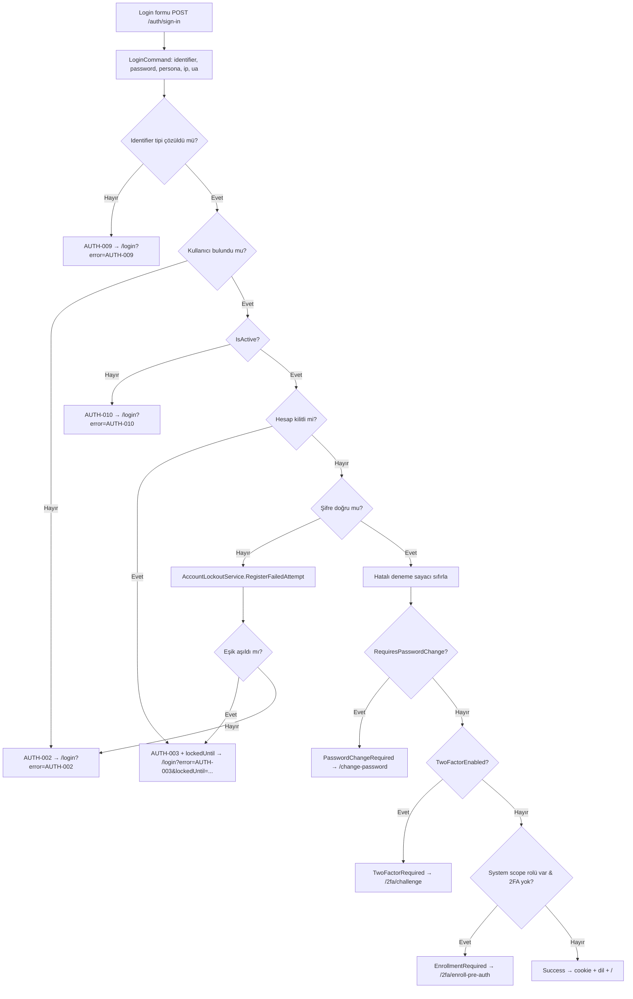

# Login Ekranları — Mantık, Akış ve İçerik

> Kapsam: **ManagementApp** (`/login`, https://localhost:7212) ve **PortalApp** (`/login`) giriş ekranları; ortak login akışı; tenant-başına **hesap kilitleme** (account lockout) özelliği ve kilit/geri-sayım gösterimi.
> Sürüm: v0.2.14 — tenant-başına lockout + login ekran revizesi.

---

## 1. Genel Bakış

İki ayrı uygulamanın login ekranı vardır ama **aynı backend akışını** kullanır:

| Uygulama | Rota | Persona | Branding | Lokalize | Forgot-password |
|----------|------|---------|----------|----------|-----------------|
| ManagementApp | `/login` | `Management` | "Domain" ikonu + marka adı | Evet (IStringLocalizer) | Var (`/forgot-password`) |
| PortalApp | `/login` | `Portal` | "HomeWork" ikonu + "Site Portalı" | Hayır (sabit TR) | Yok |

**Mimari not — Static SSR:** Her iki login sayfası da **statik sunucu render** edilir (interaktif Blazor değil). Form klasik HTML `<form method="post">` ile `/auth/sign-in` endpoint'ine gönderilir. Bu yüzden:
- Hata/durum bilgisi sayfaya **query string** ile döner (`?error=...`, `?info=...`, `?lockedUntil=...`).
- Canlı davranış (kilit geri sayımı) için sayfaya gömülü **saf JavaScript** kullanılır (SignalR/Blazor interaktivitesi yok).

İlgili dosyalar:
- [Login.razor (Management)](../../../src/Presentation/CleanTenant.ManagementApp/Components/Pages/Login.razor)
- [Login.razor (Portal)](../../../src/Presentation/CleanTenant.PortalApp/Components/Pages/Login.razor)
- [AuthEndpoints.cs (Management)](../../../src/Presentation/CleanTenant.ManagementApp/Auth/AuthEndpoints.cs)
- [AuthEndpoints.cs (Portal)](../../../src/Presentation/CleanTenant.PortalApp/Auth/AuthEndpoints.cs)
- [LoginCommandHandler.cs](../../../src/Core/CleanTenant.Application/Features/Auth/Login/LoginCommandHandler.cs)

---

## 2. Ekran İçeriği (Alanlar)

**Ortak form alanları:**
1. **Kimlik (identifier)** — E-posta / TCKN / Telefon (PortalApp'te etiket bunu açıkça yazar). `autocomplete="username"`, `autofocus`.
2. **Şifre (password)** — `autocomplete="current-password"`.
3. **Beni hatırla (rememberMe)** — checkbox. Management metni `Login.RememberMe.Days`; Portal "Beni hatırla (7 gün)".
4. **Giriş Yap (submit)** — form'u `/auth/sign-in`'e POST eder.
5. **Gizli alan `persona`** — Management'ta `Management` sabit; Portal endpoint'i persona'yı kod tarafında `Portal` set eder.

**Üst bilgi/durum alanları (yukarıdan aşağıya):**
- **Marka başlığı** (ikon + ad).
- **Bilgi şeridi** (`?info=...`) — örn. şifre sıfırlama başarısı (`password-reset-success`).
- **Hata şeridi / kilit kartı** — aşağıda Bölüm 5.
- (Management) **Şifremi unuttum** linki + sürüm/footer.

---

## 3. Giriş Akışı (uçtan uca)

**Adımların özeti** ([LoginCommandHandler.Handle](../../../src/Core/CleanTenant.Application/Features/Auth/Login/LoginCommandHandler.cs)):
1. **Identifier çözümü** — email / TCKN / VKN / telefon. Tanınmazsa `AUTH-009`.
2. **Kullanıcı arama** — TCKN/telefon için `*Verified`/`*Confirmed` şartı. Bulunmazsa `AUTH-002` (kimlik var/yok bilgisi sızdırılmaz).
3. **IsActive** — pasif hesap `AUTH-010`.
4. **Kilit kontrolü** — `IsLockedOutAsync` → kilitliyse `AUTH-003` (+ `lockedUntil`).
5. **Şifre doğrulama** — yanlışsa tenant-başına politikaya göre sayaç artırılır; eşik aşıldıysa kilitlenir (`AUTH-003`), aksi halde `AUTH-002`.
6. Şifre doğruysa sayaç sıfırlanır; sonra sırayla **zorunlu şifre değişimi → 2FA → pre-auth enrollment → normal finalize** dallanması.

**Redirect matrisi** (endpoint `SignInAsync`):

| LoginStatus / sonuç | Yönlendirme | Çerez |
|---------------------|-------------|-------|
| Failure | `/login?error=CODE` (+`&lockedUntil=` AUTH-003'te) | — |
| `TwoFactorRequired` | `/2fa/challenge` | challenge cookie |
| `EnrollmentRequired` | `/2fa/enroll-pre-auth` | enrollment cookie |
| `PasswordChangeRequired` | `/change-password` | password-change cookie |
| `Success` | `/` | oturum cookie + dil cookie |

---

## 4. Hata Kodları → Mesaj Eşlemesi

| Kod | Anlam | Management mesaj anahtarı | Şiddet |
|-----|-------|---------------------------|--------|
| AUTH-001 | Kimlik/şifre boş | `Login.Error.IdentifierRequired` | Warning |
| AUTH-002 | Geçersiz kimlik veya şifre | `Login.Error.Invalid` | Error |
| AUTH-003 | Hesap kilitli | `Login.Error.Lockout` / kilit kartı | Error |
| AUTH-004 | Yönetim/portal erişim yetkisi yok | `Login.Error.NoManagementScope` | Error |
| AUTH-009 | Kimlik tipi tanınamadı | `Login.Error.IdentifierTypeUnknown` | Warning |
| AUTH-010 | Hesap devre dışı | `Login.Error.Deactivated` | Error |
| AUTH-2FA-* | 2FA challenge/enrollment durumları | `Login.Error.*` | Info/Warning |

---

## 5. Hesap Kilitleme (Account Lockout)

### 5.1 Tenant-başına politika

Kilit davranışı **tenant bazında** ayarlanır; ayarlar Catalog DB `tenants` tablosunda tutulur (login anında tenant context seçilmeden Catalog'dan okunabilmesi için):

| Kolon | Açıklama | Varsayılan |
|-------|----------|-----------|
| `lockout_enabled` | Kilitleme aktif mi | `true` |
| `lockout_max_failed_attempts` | Kilit için gereken ardışık hatalı deneme | `5` |
| `lockout_duration_minutes` | Kilit süresi (dakika) | `15` |

İlgili: [Tenant.cs](../../../src/Core/CleanTenant.Domain/Identity/Tenants/Tenant.cs), migration `AddTenantLockoutPolicy`.

### 5.2 Etkin politika çözümü

[AccountLockoutService](../../../src/Core/CleanTenant.Application/Common/Auth/AccountLockoutService.cs) + saf karar sınıfı [LockoutDecision](../../../src/Core/CleanTenant.Application/Common/Auth/LockoutDecision.cs):

- Kullanıcının **aktif tenant atamaları** bulunur.
- **Tam olarak bir** tenant'a bağlıysa → o tenant'ın politikası.
- **0 tenant** (System kullanıcı) veya **birden çok** tenant (çok-tenant'lı kullanıcı) → `LockoutPolicy.Default` (**5 deneme / 15 dk**).

### 5.3 Identity yerleşik kilidi devre dışı

ASP.NET Identity'nin otomatik kilidi global (tek eşik) olduğu için **devre dışı** bırakıldı:
`opts.Lockout.MaxFailedAccessAttempts = int.MaxValue` ([DependencyInjection.cs](../../../src/Infrastructure/CleanTenant.Infrastructure.Persistence/DependencyInjection.cs)).
`AccessFailedAsync` yalnız sayacı artırır; **kilit kararı** `AccountLockoutService`'te tenant politikasına göre verilir. Aynı servis **2FA hatalı kod** denemelerinde de kullanılır ([VerifyTwoFactorCommandHandler](../../../src/Core/CleanTenant.Application/Features/Auth/TwoFactor/VerifyTwoFactor/VerifyTwoFactorCommandHandler.cs)).

### 5.4 Login ekranında gösterim (Tasarım C + güvenlik tercihi)

- **Kalan deneme sayısı GÖSTERİLMEZ.** Hatalı girişte jenerik "Geçersiz kimlik veya şifre" döner. Sebep: kalan-hak sayacı geçerli bir hesabın varlığını ima eder (**username enumeration** riski).
- **Hesap kilitliyse** (`AUTH-003` + `?lockedUntil=<ISO-UTC>`) şık **kırmızı kilit kartı** gösterilir: kilit ikonu + "Hesabınız geçici olarak kilitlendi" + **canlı geri sayım** (mm:ss). Süre dolunca sayfa otomatik `/login`'e döner ve form yeniden açılır.
- Kilitliyken form alanları ve buton **disabled**.
- `lockedUntil`, handler'da `Error.Metadata["lockedUntil"]` (ISO 8601 / UTC) olarak üretilir ([Error.cs](../../../src/Core/CleanTenant.SharedKernel/Common/Errors/Error.cs)) ve sign-in endpoint'i query string'e ekler.

Geri sayım saf JS ile çalışır (Static SSR): `data-until` attribute'undaki UTC zamanı ile `Date.now()` farkını her saniye günceller.

### 5.5 Kilidi açma (Unlock)

Kilitli kullanıcının kilidi admin tarafından açılabilir:
- Komut: [UnlockUserCommand](../../../src/Core/CleanTenant.Application/Features/System/Users/UnlockUserCommand.cs) — `[RequirePermission("System.Users.Manage", "User.Lockout")]`. Böylece **TenantAdmin kendi tenant'ındaki** kullanıcıların kilidini açabilir (`User.Lockout` izni TenantAdmin'de var).
- İşlem: `LockoutEnd = null` + hatalı deneme sayacı sıfırlama ([UserRepository.UnlockAsync](../../../src/Infrastructure/CleanTenant.Infrastructure.Identity/Users/UserRepository.cs)).
- UI: **Erişim Yönetimi → Kullanıcılar** listesinde, kullanıcı kilitliyse (`IsLocked`) yeşil **"Kilidi Aç"** (LockOpen) ikonu ([UserListPanel.razor](../../../src/Presentation/CleanTenant.ManagementApp/Components/Shared/UserListPanel.razor)).
- API: `POST /api/v1/users/{userUrlCode}/unlock` ([UserAdminEndpoints.cs](../../../src/Presentation/CleanTenant.WebApi/Endpoints/UserAdminEndpoints.cs)).

### 5.6 Tenant lockout ayarlarını düzenleme

Politika, paylaşılan [TenantForm](../../../src/Presentation/CleanTenant.ManagementApp/Components/Shared/TenantForm.razor) **"Güvenlik"** tab'ından düzenlenir (kilitleme aç/kapa + maks. deneme 1–50 + süre 1–1440 dk). [UpdateTenantCommand](../../../src/Core/CleanTenant.Application/Features/Catalog/Tenants/UpdateTenantCommand.cs) hem System operatörü hem TenantAdmin için bu alanları yazar (değerler makul aralığa clamp edilir).

| Kim | Nereden |
|-----|---------|
| System operatörü | `/system/tenants/{urlCode}/edit` (TenantEditPage) |
| TenantAdmin (kendi yönetimi) | `/tenant/settings` (TenantSettingsPage) |

---

## 6. Lokalizasyon

Yeni anahtarlar [LocalizationCatalog.cs](../../../src/Infrastructure/CleanTenant.Infrastructure.Persistence/Seeding/LocalizationCatalog.cs)'a eklendi; `LocalizationSeeder` startup'ta idempotent upsert eder (TR + EN):
- `Login.Locked.Title`, `Login.Locked.Message`, `Login.Locked.RemainingLabel`
- `TenantForm.Tab.Security`, `TenantForm.Security.*`
- `SystemUsers.List.Action.Unlock`, `SystemUsers.Unlock.Title`, `SystemUsers.Unlock.Confirm`, `SystemUsers.UnlockSuccess`

PortalApp login lokalize değildir (sabit Türkçe); kilit kartı metinleri orada sabit yazılıdır.

---

## 7. Davranış Doğrulama (manuel)

Geliştirme ortamında uçtan uca doğrulandı (EMLAK YÖNETİM tenant'ı, politika 5/15):

| Adım | Beklenen | Sonuç |
|------|----------|-------|
| 1–4. hatalı giriş | `/login?error=AUTH-002` | ✅ |
| 5. hatalı giriş | `/login?error=AUTH-003&lockedUntil=...` | ✅ |
| Kilitliyken 6. deneme | Anında `AUTH-003` (sayaç artmaz) | ✅ |
| Login sayfası (AUTH-003) | Kilit kartı + geri sayım script'i render | ✅ |
| Kilit süresi | now + 15 dk | ✅ |

---

## 8. İlgili Dosyalar (özet)

| Katman | Dosya |
|--------|-------|
| Domain | `Identity/Tenants/Tenant.cs` (lockout kolonları) |
| Application | `Common/Auth/{LockoutPolicy,LockoutDecision,IAccountLockoutService,AccountLockoutService}.cs` |
| Application | `Features/Auth/Login/LoginCommandHandler.cs`, `Features/Auth/TwoFactor/.../VerifyTwoFactorCommandHandler.cs` |
| Application | `Features/System/Users/UnlockUserCommand(+Handler).cs` |
| Application | `Features/Catalog/Tenants/UpdateTenantCommand(+Handler).cs` |
| SharedKernel | `Common/Errors/Error.cs` (Metadata) |
| Infrastructure | `Persistence/DependencyInjection.cs` (IdentityOptions), `Identity/Users/UserRepository.cs` (UnlockAsync) |
| Infrastructure | `Persistence/Catalog/Configurations/TenantConfiguration.cs`, migration `AddTenantLockoutPolicy` |
| Presentation | `ManagementApp/Components/Pages/Login.razor`, `PortalApp/Components/Pages/Login.razor` |
| Presentation | `*/Auth/AuthEndpoints.cs` (sign-in), `ManagementApp/Components/Shared/{TenantForm,UserListPanel}.razor` |
| Presentation | `WebApi/Endpoints/UserAdminEndpoints.cs` (unlock) |
| Test | `tests/CleanTenant.Application.UnitTests/Auth/LockoutDecisionTests.cs` |
