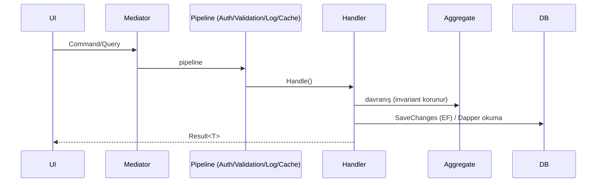

# Mimari Genel Bakış

> Yeni projenin `docs/wiki/` altına. Faz kapanışındaki detaylı harita
> `docs/phases/vX.Y/` altında yaşar; bu dosya kalıcı üst-bakıştır.

## Katmanlar (Clean Architecture)

```mermaid
flowchart TD
    P[Presentation<br/>WebApi · ManagementApp] --> A[Application<br/>CQRS + MediatR]
    A --> D[Domain<br/>Aggregates · Events]
    A --> SK[SharedKernel]
    D --> SK
    INF[Infrastructure<br/>Persistence · Identity · Caching · ...] -. implements .-> A
    P --> INF
    classDef core fill:#e3f2fd; class A,D,SK core
```

Kural: **Core, Infrastructure'a bağımlı değildir.** NetArchTest bunu denetler.

## İstek akışı (CQRS)



## Veri katmanı
- 4 PostgreSQL DB: **Catalog** (kimlik/lokalizasyon), **Main** (tenant iş varlıkları),
  **Log** (Serilog), **Audit** (değişiklik izi).
- Yazım EF Core, okuma Dapper. Multi-tenancy: `ITenantScoped` global query filter.
- Domain event'ler `BaseEntity` tamponunda toplanır, **Outbox** ile dağıtılır.

## Daha fazlası
- Kararlar: `docs/wiki/adr/`
- Güvenlik: `docs/wiki/security/`
- Faz haritaları: `docs/phases/`
